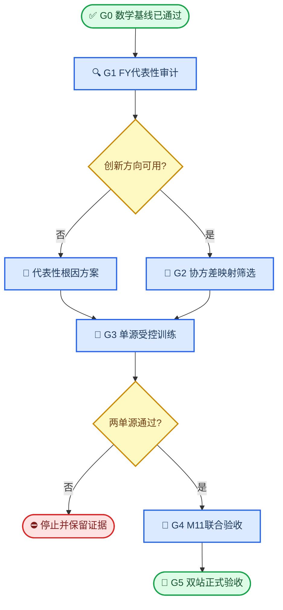

# run66 错误同化方向修正：持续目标与阶段门禁草案

_草案日期：2026-07-29。供确认后写入持续目标任务；当前不启动新实验或训练。_

> 📌 **状态：** 本计划保留为历史审计记录。后续开发改用[模型内优化与ISR盲验收计划](./run66-model-internal-optimization-goal-plan.md)。

## 🎯 目标定义

在保持 `D64/N8` 低维状态、联合ETKF、共享密度空间观测算子和连续密度解码的前提下，定位并修正FY/COSMIC在不同高度、地方时和地理位置上的错误同化方向，使Analysis在独立ISR验证中比Background更接近观测，并在预先声明的最终指标上同时达到或优于Raw IRI。

建议写入持续目标任务的目标文本：

> 按顺序门禁定位并修正run66的观测代表性、低维交叉协方差和联合更新方向问题；保持低维联合ETKF的数学正确性与连续解码。最终使Jicamarca和Poker Flat的Analysis在正式全站ISR、低层夜间、峰参数及时间连续性指标上优于Background，并在预先声明指标上不差于Raw IRI。任一硬门禁失败时停止扩展，只推进证据支持的唯一根因。

### 语义边界

- **Raw IRI**：未经神经背景修正的原始IRI，是独立基线。
- **Background / M00**：冻结Background网络输出；M00必须逐元素等于Background，但不等于Raw IRI。
- **Analysis / M10 / M01 / M11**：分别表示FY单源、COSMIC单源和双源联合ETKF分析。
- **物理创新**：观测坐标上的 `y_obs - Background(c)`。
- **ISR目标增量**：查询坐标上的 `ISR(q) - Background(q)`。
- **方向率**：Analysis增量或来源贡献与ISR目标增量同号的比例，仅在非零增量且有效覆盖点统计。
- **抽样方向诊断**：用于定位根因，不替代正式全站ISR。
- **正式ISR验收**：固定站点、时间、高度范围和评估脚本的全量结果；ISR不参与checkpoint选epoch。

“不同地理位置”本阶段只由Jicamarca和Poker Flat两个独立站点验证，不能外推为全球证明。无局部观测时允许M00，不以扩大窗口伪造覆盖。

## 📍 当前基线与已完成成果

| 项目 | 当前结果 | 状态 |
|---|---:|---|
| 共享padding不变量 | 追加无效token不改变输出；全无效单源等于M00 | 已通过 |
| 数学与工程回归 | 46项测试通过；strict加载成功；72个tensor全部有限 | 已通过 |
| 当前checkpoint SHA256 | `84e7bb5c6e52b9d51911dea07835b50afd58cbc43c16af972166edb6ead3d127` | 已冻结 |
| 高 `h_cut` 原始曲线审计 | 600候选＋200控制；未发现系统性假阳性 | 已通过，不改QC |
| 经验跨源协方差 | 符号一致率97.61%，共同稳定质量35.80%，稳定单元25.84% | 结构覆盖不足 |
| Jicamarca FY，夜间120–300 km | 全观测方向率45.53%，RMSE 0.6019 | 未通过 |
| Jicamarca COSMIC，夜间120–300 km | 全观测方向率52.12%，RMSE 0.6048 | 未通过 |
| Jicamarca M11，夜间120–300 km | 方向率48.83%，RMSE 0.6061 | 未通过 |
| `|Δh|≤20 km`反事实 | COSMIC方向率提高7.96个百分点且RMSE下降；FY方向率下降3.56个百分点 | 未达10个百分点门槛 |
| Poker Flat有限性 | M00/M10/M01/M11有限，无Cholesky失败 | 已通过 |
| Poker Flat COSMIC覆盖 | 固定窗口为0 | 不能评价高纬COSMIC |
| ISR日期覆盖 | Jicamarca 7个UTC日；Poker Flat 25个UTC日 | 已盘点 |
| Jicamarca ISR质量语义 | 产品说明警告夜间spread-F污染；当前文件无对应质量标志 | 待解决 |

当前证据不支持直接实施连续垂直局地化。最强根因线索是Jicamarca低层夜间FY观测创新与ISR目标同向率仅32.30%，即观测/站点的时空代表性冲突；COSMIC同时存在交叉协方差反号风险，但不是全部退化的充分解释。

## 🚦 顺序门禁

## ✅ 最终可衡量成果

### 数学正确性

- M00与Background最大绝对差 `<1e-7`。
- 零创新密度增量 `<1e-7`。
- FY/COSMIC交换顺序不改变联合结果，误差 `<1e-6`。
- 两来源贡献之和等于M11总增量，误差 `<1e-6`。
- padding、全无效单源、无覆盖行、square-root transform和重复推理全部通过。
- checkpoint `strict=True`加载；全部参数、梯度和输出有限；记录SHA256。

### 方向正确性

- FY、COSMIC留一profile高置信协方差符号准确率均 `≥60%`。
- 两来源负创新正确响应率均 `≥70%`。
- Jicamarca夜间120–300 km有效覆盖点的M10、M01趋向ISR比例均 `≥55%`。
- 对 `ISR-Background≤-0.05 dex` 的点：
  - `P(delta>0.05)≤10%`；
  - 正向增量 `p95≤0.05 dex`；
  - 正向增量 `p99≤0.10 dex`。
- 按 `120–200/200–300/300–500 km × 昼/夜 × 站点` 报告结果；样本不足的单元标为不可估计，不合并或降低门槛。

### 独立ISR质量

正式验收统一重新计算Raw IRI、Background和Analysis，禁止混用抽样诊断值。

| 正式指标 | 硬门槛 |
|---|---:|
| Jicamarca整体RMSE | `≤min(Raw IRI, Background, 0.2403)` |
| Jicamarca夜间120–300 km RMSE | `≤0.4717`，同时优于Background `0.5572` |
| Poker Flat整体RMSE | `≤min(Raw IRI, Background, 0.4295)` |
| Poker Flat hmF2 MAE | `≤min(Raw IRI, Background, 57.39 km)` |
| M10/M01整体与低层夜间RMSE | `≤Background×1.01` |
| M11共同覆盖RMSE | `≤最佳单源×1.01` |

若历史常数与重新运行的同口径基线不一致，以本次固定脚本重新计算值为事实，并保留历史常数作为更严格上限，不用抽样值替换正式值。

### 连续性、泛化与效率

- Analysis增量的时间二阶差分MAD相对当前D64/N8模型下降 `≥30%`，低频RMSE恶化 `≤1%`。
- 高度连续性在无窗口边界切换时保持有限、连续；不得因硬高度筛选制造断层。
- Profile验证分数为 `0.5×FY profile RMSE + 0.5×COSMIC profile RMSE`，候选不得比对照差 `>1%`。
- 维持D64/N8和8维集合空间求解；新诊断或修正的CPU推理时间和峰值内存相对当前模型增加均 `≤10%`。超出时先定位实现，不升级D128/256或N16。

## 🧪 阶段计划

### G0：数学与数据语义基线

**状态：已完成。**

保留当前padding修复、QC、Global R、D64/N8和checkpoint作为冻结对照。任何后续候选都必须重复全部硬不变量；失败即停止，不比较ISR。

### G1：FY–Jicamarca代表性审计

**状态：已停止；确认FY–Jicamarca代表性冲突，不进入G2。**

按日期、FY卫星、profile、20 km高度、1 h LT、地理距离四分位和垂直距离拆分：

\[
d_j=y_{\mathrm{FY}}(c_j)-B(c_j),\qquad
r_q=\mathrm{ISR}(q)-B(q)
\]

高置信样本要求 `|d_j|≥0.05 dex`、`|r_q|≥0.05 dex`、`precision>0`。以profile为统计单位，按日期分块bootstrap 1000次。

交付成果：

- 全观测、同高度层和 `|Δh|≤20 km` 的创新同向率及95%置信区间；
- 最近距离半区与最远距离半区的差异；
- top-20冲突profile、日期和卫星贡献集中度；
- ISR查询点与邻域观测的时间、水平距离、高度支持和局地化精度；
- 区分“观测创新冲突”“协方差反号”“Kalman混合反号”。

门禁：

- 近高度、最近距离半区的FY创新同向率 `≥55%`，且95%置信区间下界不低于50%：进入G2。
- 若点估计 `<55%` 或置信区间显示无稳定优势：判为代表性冲突，不恢复协方差损失、不用R补偿；只规划基于观测元数据、train-only证据且不使用ISR标签的代表性处理。
- 索引、坐标或Background语义不一致：先修共享实现，重做G1。

2026-07-29结果：

- Jicamarca夜间120–300 km共4,402个ISR查询点；M10/M11合计92,752个FY token。
- 主门禁含2,445个profile-query pair、20条FY profile和5个日期；高置信pair为2,143个。
- `|Δh|≤20 km`且最近距离半区的profile等权创新同向率为36.28%，95% CI为18.66%–58.31%，未达到55%/下界50%门槛。
- M10贡献同向率同为36.28%；负交叉协方差和负Kalman增益均为0，66.36%的高置信pair属于“观测冲突被正确传播”。
- M10到M11的贡献方向翻转率为0；本门禁范围内联合COSMIC未把正确FY方向翻坏。
- 最近综合距离四分位同向率37.83%，最近水平距离四分位43.06%，垂直距离0–5 km为42.85%；缩短距离不能恢复正确方向。
- FY3D/FY3F同向率分别36.43%/41.96%，FY3E为61.87%但仅10条profile且CI下界33.76%；冲突不是单一卫星可稳定解释。
- 重复运行的NPZ/JSON/CSV逐字节一致；全库46项测试通过。

### R1：来源/站点代表性根因方案

**状态：已停止；未找到可独立复现的metadata规则。**

G1的ISR冲突标签只用于描述，不得直接成为训练或推理筛选标签。候选代表性判据只能来自观测时空元数据、QC指标和冻结Background残差形态，并在train-only、profile-blocked的FY–COSMIC独立共址样本上确定：

1. 在日期、FY卫星、查询高度和LT内匹配G1冲突/非冲突profile，定位SZA、`h_cut`、hmF2、QC指标、水平/时间距离及残差形态的差异。
2. 任何候选规则先在不少于15个日期、200条profile的train-only FY–COSMIC共址样本上按日期留一验证；不读取ISR标签。
3. 候选规则须使跨源残差方向一致率提高至少5个百分点、每个日期折不恶化、并保留至少70%的有效precision质量，才允许冻结。
4. 冻结规则只在Jicamarca执行一次不调参复核；须保留至少50%的原FY profile-query pair，并使G1创新同向率达到55%、CI下界达到50%。

未形成上述独立证据时，结论为“当前数据不能支持FY在该站点/时段的有益同化”，保持M00或COSMIC单源，不用R、协方差损失或网络gate补偿。

2026-07-29结果：

- G1的20条profile中，只有FY `hmF2`达到探索候选门槛：Spearman=0.653，95% CI为0.227–0.927；冲突/非冲突profile的hmF2中位数为302.16/312.51 km。
- 候选随后在59,958条FY、75,958条COSMIC train-only profile构成的独立FY→COSMIC共址残差中验证；最终有4,008条FY target profile、30个日期可估计。
- 按预注册的hmF2第30百分位保留规则，跨源方向一致率仅由62.26%升至63.61%，提高1.34个百分点，未达到5个百分点。
- 保留precision质量为68.76%，未达到70%；30个日期留一折仅73.33%不恶化，未达到100%。
- 独立样本中hmF2与跨源方向率Spearman仅0.108；虽然CI为0.060–0.155，但效应不足以支持运行时筛选。
- 两级审计均重复运行并产生相同SHA256；不从20条ISR profile的相关性构造门控。

### R2：ISR-only证据边界与目标质量

**状态：进行中；完成数据盘点，尚缺Jicamarca spread-F可追溯标志。**

用户确认站点附近同步独立观测只有现有ISR。ISR继续作为评价观测，不能同时用于拟合运行时代表性规则和最终独立验收；若使用ISR开发任何传输算子，必须按完整UTC日期隔离开发集与从未参与选择的锁定验收集。

2026-07-29盘点结果：

- Jicamarca共7个UTC日、32,188个当前QC有效点，其中12,517点位于120–300 km、5,003点同时属于夜间120–300 km；FY实际共址只覆盖6个日期，G1主门禁仅5个有效日期，不足以同时支持稳定规则开发和独立日期验收。
- Poker Flat共25个UTC日、174,042个当前QC有效点，其中102,508点位于120–300 km；可按日期阻断，但现有固定窗口COSMIC覆盖为0，只能提供高纬FY证据，不能验证低纬FY/COSMIC传输。
- Jicamarca产品自带说明明确指出：140 km以下（正午180 km以下）参数应舍弃，夜间spread-F期间参数也应舍弃。当前`isr_loader._qmask`只检查有限值、正值及`dne/ne<0.5`。
- 现有Jicamarca HDF5只有Ne/DNe/Te/Ti及其误差，没有spread-F、fit quality或事件标志。夜间120–300 km中仅11点低于140 km，因此单纯提高最低高度不能解释当前方向冲突；不得据此任意删除整个夜间区间。
- Poker Flat产品提供`CHISQ`，但当前loader未读取；它属于ISR自身拟合质量审计，不得混同为卫星QC或ETKF R。

R2门禁：

1. 优先取得与这些Jicamarca记录对应的provider spread-F时段、ionogram标志或正式质量字段；只接受可追溯标志，不从当前Analysis误差反推筛选规则。
2. 在标志到位前，Jicamarca夜间120–300 km只能作为“含潜在目标污染的诊断”，不得用于训练、gate、R、传输算子定参或checkpoint选择。
3. Poker Flat可用于独立的FY高纬日期阻断复核，但不得外推证明Jicamarca低纬或COSMIC有效。
4. 若无法取得spread-F标志或新的未查看ISR日期，保持当前停止结论；不把同一7日ISR拆分后宣称为新的独立物理证据。

### G2：交叉协方差映射筛选

**状态：禁止启动；G1方向门禁和R1独立规则门禁均失败。**

先离线确认train-only、profile-blocked的稳定残差相关结构；稳定覆盖不足时停止。若证据充足，只在相同10% profile manifest上设计单因素screen，固定QC、Global R、D64/N8、decoder、窗口、batch顺序和seed。

通过条件：

- FY/COSMIC高置信协方差符号准确率均 `≥60%`，平均相对当前模型提高 `≥3` 个百分点；
- 两来源负创新正确响应率均 `≥70%`；
- 夜间120–300 km留一profile趋向率均 `≥55%`；
- profile验证分数不差于对照 `>1%`；
- 有效秩q05 `≥4.0`、条件数q95 `≤3.001`；
- 所有硬不变量和有限梯度检查通过。

未全部通过则停止，不通过修改R、状态维数、成员数或额外架构补偿。

### G3：单源受控训练

**条件启动：代表性处理或G2 screen通过。**

从同一冻结Background重新初始化Analysis，seed=42，Global R，FY QC v2、现有COSMIC QC，训练5个Analysis epoch；不加载旧Analysis参数。checkpoint只按FY/COSMIC profile RMSE等权选择。

先验收M10和M01：

- 整体及夜间120–300 km RMSE `≤Background×1.01`；
- 有效覆盖点趋向ISR比例 `≥55%`；
- 负需求点正向长尾满足最终门槛；
- 两站结果有限，且无Cholesky失败。

任一单源失败即停止，不进入M11。

### G4：联合ETKF与M11

**条件启动：M10和M01均通过。**

- M11必须继续使用一次联合ETKF，不将两个独立分析事后相加。
- FY/COSMIC来源贡献之和严格等于联合密度增量。
- 共同覆盖点RMSE不得高于最佳单源的101%。
- 若单源正确而M11退化，只定位联合观测协方差混合；不改已通过的单源结构。

### G5：正式双站与分层验收

**条件启动：G4通过。**

严格加载最佳checkpoint并记录SHA256、代码/数据/QC身份。依次运行：

1. Jicamarca正式全站ISR；
2. Poker Flat正式全站ISR与hmF2；
3. M00/M10/M01/M11；
4. 三高度层、昼夜、日期和站点分层；
5. 时间及高度连续性；
6. 重复推理确定性。

只有“数学正确性、方向正确性、独立ISR质量、连续性与效率”全部通过，才允许将run66标记为达成，并另行讨论P2/P3。ISR只作最终独立门槛，不用于选epoch或反复调参。

## 📊 持续追踪字段

每次目标任务更新只追加一行，避免另建并行账本：

| 日期 | 阶段 | 状态 | 唯一变量 | 输入身份 | 输出目录 | 核心指标 | 门禁 | 停止原因 | 唯一下一步 |
|---|---|---|---|---|---|---|---|---|---|
| 2026-07-29 | G0 | 通过 | padding共享修复 | checkpoint SHA `84e7…127` | `model_attribution-padding-fixed` | 46 tests；strict；有限 | 通过 | — | G1 FY代表性审计 |
| 2026-07-29 | G1 | 停止 | FY代表性只读审计 | checkpoint SHA `84e7…127`；FY QC v2 | `run66-direction-correction-g1-fy-jicamarca-representativeness` | 36.28%方向率；CI 18.66%–58.31%；M10→M11翻转0% | 未通过 | 观测创新与ISR目标冲突 | R1 metadata-only代表性审计 |
| 2026-07-29 | R1 | 停止 | hmF2独立验证 | FY/COSMIC train-only；Background SHA按报告 | `metadata-only-audit/train-only-hmf2-validation` | +1.34 pp；precision 68.76%；日期非负73.33% | 未通过 | ISR探索相关性不能独立复现为有效规则 | 保持M00/COSMIC；禁止G2/G3 |
| 2026-07-29 | R2 | 进行中 | ISR证据边界盘点 | Jicamarca 7日；Poker Flat 25日 | 现有ISR目录 | Jic 5,003个夜间120–300 km点；无spread-F标志 | 未判定 | ISR目标质量与独立性不足 | 获取provider spread-F时段/质量标志 |

阶段状态仅使用：`未开始`、`进行中`、`通过`、`停止`。每次运行同时记录：

- checkpoint、代码、FY/COSMIC NPY与index、QC报告和split manifest的SHA256；
- 固定seed、样本数、有效覆盖率和不可估计单元；
- 训练最佳epoch和墙钟时间（若有）；
- 通过/失败的逐项指标；
- 禁止并行项是否保持不变。

## ⚠️ 风险与停止规则

| 风险 | 当前证据 | 控制 |
|---|---|---|
| FY/ISR时空代表性冲突 | G1 profile等权方向率36.28%，CI下界18.66% | R1只用独立元数据证据；不用R或loss掩盖 |
| 低层固有稀疏 | FY/COSMIC 120–200 km覆盖有限 | 不扩大窗口；稀疏单元标记不可估计 |
| 协方差符号覆盖不足 | 共同稳定质量35.80% | 先离线确认，再允许监督 |
| 跨高度负协方差 | COSMIC限制高度后改善但仅7.96个百分点 | 不直接实施垂直局地化 |
| 地理泛化不足 | Poker Flat无COSMIC覆盖 | 不宣称全球双源有效 |
| 联合更新退化 | 当前M11低层方向率48.83% | 两单源通过后才检查M11 |
| 基线口径混用 | 抽样M00与历史全站RMSE不同 | 正式验收同脚本重算三条基线 |
| ISR目标污染/标签泄漏 | Jicamarca产品警告夜间spread-F；同7日已反复诊断 | 只接受provider标志；ISR不用于运行时规则定参 |
| CPU成本 | 全量训练和双站诊断较慢 | 先只读/10% screen；每阶段单变量 |

全局停止规则：

- 任一数学硬不变量失败；
- G1确认观测代表性冲突但尚无不依赖ISR标签的物理处理依据；
- 任一来源单源门槛失败；
- 双站正式门槛任一失败；
- 为通过门槛需要同时调整R、QC、维数、成员数或架构。

## 🔜 当前停止结论

G1与R1均未通过。用户进一步确认同步独立观测只有现有ISR；R2又确认Jicamarca只有7个UTC日，且产品警告夜间spread-F污染而文件未提供对应质量标志。现有FY/COSMIC、Background、局部窗口和ISR文件仍不能为Jicamarca低层夜间FY更新提供方向可靠、目标可信且不依赖ISR标签的判据。按预注册停止规则：

- 不构造hmF2、卫星、日期或站点专用gate；
- 不恢复协方差损失，不用R吸收代表性冲突；
- 不实施垂直局地化，不训练，不调整QC/D64/N8/decoder；
- 不进入G2、G3、P2或P3；
- 在该条件下，FY不得作为“已证明有益”的更新来源；只能保持M00，或在COSMIC单源已独立通过时使用M01。
- 不把相同7日ISR拆成开发/验收后宣称为新的独立证据；优先补充provider spread-F时段、ionogram标志或新的未查看ISR日期。

若要继续实现总目标，需要先获得新的、独立的物理可识别信息，例如站点附近同步观测或经外部数据验证的观测到查询位置传输算子。仅在明确扩展当前目标范围并预注册新证据来源后，才能制定下一阶段；当前代码和数据内不再增加补偿项。
