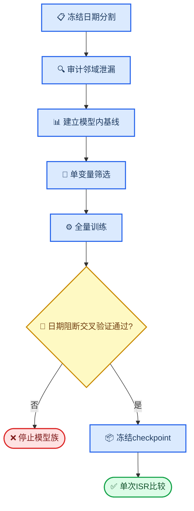
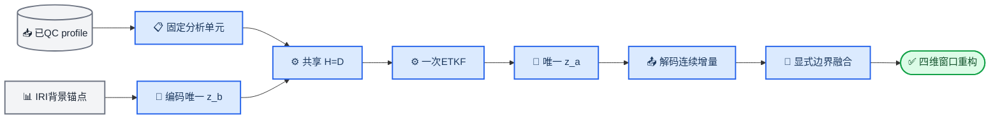

# run66 模型内优化与ISR一次性外部比对持续目标

_修订日期：2026-08-02。研究数据范围固定为2024年9月全月；替代以ISR作为中间门禁或引入其他月份卫星数据的路线。旧结果保留为审计记录。_

---

## 🎯 目标与边界

在保持`D64/N8`低维状态、联合ETKF、共享密度空间观测算子和连续密度解码的前提下，仅使用FY/COSMIC的train与development profile优化模型，使其对未参与参数学习的卫星profile产生方向正确、误差更小、创新与协方差关系可解释且统计校准可审计的分析增量。

开发期间禁止读取ISR数值、按ISR结果选择超参数或checkpoint。由于2024年9月原locked-test已经揭示且研究范围不能扩展，后续不再声称存在新的卫星盲测集；候选配置须通过预先固定的日期阻断模型内交叉验证，随后冻结代码、数据身份和checkpoint，并一次性与Jicamarca、Poker Flat的Raw IRI和Background比较。

### 语义边界

- **模型内优化**：目标profile作为验证真值，但必须从邻域观测中排除；训练与验证按完整UTC日期阻断
- **M00**：无观测更新，逐元素等于冻结Background
- **M10/M01/M11**：FY单源、COSMIC单源和一次联合ETKF分析
- **方向率**：Analysis增量与目标profile的`观测−Background`同号，仅在绝对残差不低于`0.05 dex`且有有效precision时统计
- **ISR一次性外部比较**：两站附近可用的同步独立观测仅为ISR；只在模型与checkpoint完全冻结后运行，结果不得反向用于本轮调参
- **外部独立性**：Jicamarca与Poker Flat是两个站点域，不是卫星development/locked-test的补充标签；不按ISR日期再次划分开发集
- **ISR质量限制**：Jicamarca夜间spread-F标志缺失，因此ISR结果需同时报告产品限制，不把潜在污染单元用于构造模型规则

## 📍 当前事实

| 项目 | 证据 | 影响 |
| --- | ---: | --- |
| 数学回归 | 64项测试通过 | 可作为冻结基线 |
| Padding不变量 | 全无效来源等于M00 | 保留 |
| 集合有效秩 | Factorized N8已解决秩塌缩 | 暂不改成员数 |
| 邻域数据隔离 | 日期/profile双隔离已实现；1000个train查询泄漏为0 | 已修复 |
| M1 development M11 | FY RMSE 0.277904，较M00改善5.57%；COSMIC RMSE 0.204749，较M00改善9.12% | 模型内联合更新有效 |
| M1自源方向 | FY M10方向率66.20%、负残差响应67.57%；COSMIC M01方向率70.47%、负残差响应72.37% | FY尚未达到70%负响应门槛 |
| M1跨源分层方向 | FY目标的M01失败45/75个可估计单元；COSMIC目标的M10失败12/47 | 当前首要模型内缺陷 |
| M1集合与校准 | 有效秩q05约6.84、条件数q95≤1.362；NIS约2.0–2.5 | 集合秩健康，但不确定性偏窄 |
| M1梯度审计 | epoch 6首100 batch辅助/观测decoder梯度比66.8% | 超过30%，后续未审计，须作为独立风险处理 |
| M2-A development | FY/COSMIC M11 RMSE分别为0.278301/0.205197，较M1恶化0.14%/0.22%；自源方向率分别下降0.09/0.13个百分点 | 误差容差通过，但方向改善门槛失败 |
| M2-A负残差响应 | FY M10 67.41%；COSMIC M01 72.43% | FY未达到70%，M2-A失败并停止M2-B |
| M2-A数值检查 | 有效秩q05为6.78/6.75，条件数q95为1.52/1.55；硬不变量、strict加载、有限参数和52项测试通过 | 数值健康，失败来自学习效果而非实现不稳定 |
| 辅助梯度归因 | 前100批time/increment/vertical对观测梯度比分别为61.00%/6.64%/1.51% | 时间二阶差分是唯一主导辅助项 |
| M2-C梯度预检 | 仅将`w_time_analysis`从0.02降至0.005后，合计梯度比均值25.81%、中位数22.65% | 通过30%长期上限，允许进入development筛选 |
| M2-C development | 最佳epoch 10，score 0.238657；FY/COSMIC M11 RMSE为0.274282/0.203032 | 相对M1分别改善1.30%/0.84%，通过筛选 |
| M2-C locked-test | FY自源负残差响应68.15%；分层方向失败FY M10/M01/M11为7/40/6个、COSMIC为11/3/3个 | 未达到70%及全分层55%硬门槛，停止模型族且不运行ISR |
| M2-F development | 最佳epoch 10，score 0.238573；FY/COSMIC M11 RMSE为0.274096/0.203049 | RMSE通过，但FY自源负响应67.35%、COSMIC目标的FY跨源方向58.86%，方向门禁失败 |
| M2-F精确方向归因 | K与交叉协方差符号一致率93.38%–97.38%；跨源创新一致率52.91%–53.05%，交叉协方差符号准确率55.03%–56.14% | 主要缺陷位于K之前的代表性与交叉协方差学习，不是联合逆矩阵把正确K翻号 |
| M2-G 100批预检 | 方向目标4%，解析λ=`5.30e-4`；总辅助/观测梯度均值29.36%，全部有限 | 通过稳定性预检；仅允许规划5 epoch development screen |
| M2-G全量筛选 | 5个epoch均未通过方向资格；最佳epoch 10 score `0.238691` | FY自源负响应最高仅67.61%，COSMIC目标的FY跨源方向最高仅58.89%；不进入三折或ISR |
| N8解析几何 | Helmert零均值、`CCᵀ=7I`和DCT状态基正交误差均≤`2.7e-15` | N8实现正确；零均值8成员理论最大秩为7，不要求8个member两两正交 |
| 观测异常子空间 | 联合`Y=HX`有效秩中位数FY/COSMIC为`1.565/1.586`，条件数中位数`8294/4365`；两源Gram重叠中位数`0.971/0.944` | 集合状态秩健康，但经density basis后几乎退化为1–2个共同物理方向 |
| 经验残差粗粒度秩 | 近距离同源3高度层经验协方差有效秩约`1.20–1.75` | 低物理秩部分来自残差场本身；不能用强制满秩或直接N16补偿 |
| 日期阻断经验协方差 | 432单元中371个可估计、129个稳定；跨源转置符号一致率98.96%，但双向共同稳定质量31.55%、稳定单元27.38% | 存在部分稳定结构，但不足以直接训练全覆盖代表性核或恢复全单元协方差监督 |
| M2-I stable-only反事实 | 两跨源整体方向由60.36%/58.89%升至62.44%/61.69%；FY/COSMIC M11 RMSE改善0.06%/0.39% | 关系选择有效，但FY自源负响应仅67.69%，14个方向可估计分层仍失败，硬掩码不能采用 |
| 日期manifest | SHA256 `0576d83c72cbcfd5994e3afcb192429f965bf423a937f88a1db26eb09e21dbab` | 固定不再重抽 |
| FY日期分割 | train 44,625；development 11,591；locked-test 10,396 profiles | profile/date交集为0 |
| COSMIC日期分割 | train 56,099；development 13,924；locked-test 14,341 profiles | profile/date交集为0 |
| ISR数据 | Jicamarca 7日；Poker Flat 25日；附近同步独立观测仅ISR | 仅作最终外部比较 |
| 研究时间范围 | 仅2024年9月全月 | 禁止引入2025/2026 FY或COSMIC；不存在新的卫星盲测日期 |

## 🔄 顺序门禁



## 📋 M0：数据隔离与可复现实验单元

从FY QC v2和现有COSMIC QC重新生成公共日期分割，不沿用已训练checkpoint的随机profile分割：

- 以UTC日期为阻断单位，seed=`42`
- 30日分为20个train日、5个development日和5个locked-test日
- 在连续日期块内平衡三组，避免某组只覆盖月初或月末
- FY/COSMIC使用相同日期集合；profile是统计单位
- R只用train profile重新校准
- train目标只能检索train候选；development和locked-test分别只能检索本集合候选，并排除目标profile
- locked-test manifest生成后只记录SHA256，M4前禁止计算任何模型指标

新增回归检查：

- train/development/test的profile与日期交集均为空
- target profile不会作为自身观测
- 任一train batch不读取development或locked-test观测值
- 默认邻域窗口、top-8和连续距离precision保持不变
- 重复生成manifest逐字节一致

任一泄漏或索引不一致立即停止，不训练。

## 📊 M1：ISR盲模型基线

仅在development集评估冻结Background和当前模型结构，从Background重新初始化Analysis。对FY目标和COSMIC目标分别计算M00、M10、M01、M11：

- profile等权RMSE、MAE和相对M00改善
- 高置信增量方向率
- 负目标残差的正确响应率及正向长尾
- 按`120–200/200–300/300–500 km × 昼/夜 × 10°纬度带`分层
- M11相对最佳单源的误差变化
- NIS、残差均值和90%预测区间覆盖作为校准诊断
- 集合有效秩、条件数、尺度饱和率和CPU成本

样本不足200条profile或不足5个日期的单元标为不可估计，不合并高度层或降低门槛。

## 🧪 M2：单变量优化

所有筛选均复用同一train/development manifest、Background、Global R、D64/N8、QC、窗口、batch顺序和5个Analysis epoch。禁止使用ISR。

### Loss缺陷判定顺序

Loss是Analysis模型的一部分，按以下顺序审计，不能预设其公式或权重正确：

1. **物理语义与mask**：目标、innovation、precision和模式必须来自同一物理观测方程；无效查询不得进入分母或梯度。
2. **统计单位**：token先在profile内聚合，再对profile和来源等权，避免长profile、高覆盖来源或高层样本主导。
3. **模式完整性**：训练目标必须显式覆盖M10、M01和M11，不能以高方差随机抽样替代最终验收目标。
4. **标量贡献与梯度竞争**：同时记录各原始/加权loss及其对共享density basis、集合尺度网络的梯度范数；辅助项合计不得长期超过主观测项30%。
5. **目标—验收一致性**：先比较profile RMSE、方向率、负残差响应和分层单元，再判断是否需要改变统计权重或增加方向约束。

允许按证据修改loss公式、统计权重和对应λ，但每次只改变一个已定位因素。Loss不得补偿错误观测方程、错误ETKF求解、反号交叉协方差、数据泄漏或ISR站点代表性差异；这些情况必须先修共享实现或数据语义。所有loss选择仅使用train/development卫星profile，禁止使用ISR或已消费locked-test。

### M2-A：来源模式暴露

比较：

- 对照：当前随机`source_dropout`
- 候选：确定性的M10:M01:M11=`1:1:2` batch日程

除来源模式日程外全部保持一致。候选进入下一阶段须同时满足：

- FY/COSMIC development profile分数均不恶化超过1%
- 两来源平均方向率提高至少3个百分点，任一来源不下降超过1个百分点
- 两来源负残差正确响应率均达到70%
- 所有硬不变量、秩和有限梯度检查通过
- CPU时间和峰值内存增加不超过10%

### M2-B：稀疏单元主损失平衡

仅M2-A通过后比较：

- 对照：profile等权Huber
- 候选：profile内先按`高度层×昼夜`等权，再对profile和来源等权的同一Huber

这不是新增辅助损失，只改变主观测误差的统计单位。候选须满足：

- 总profile验证分数不恶化超过1%
- 两来源夜间120–300 km方向率均至少55%
- 稀疏单元改善不得以300–500 km或白天RMSE恶化超过1%为代价
- 前100 batch辅助项对主观测项的decoder梯度比不长期超过30%

任一阶段失败即保留上一配置；不通过调R、恢复协方差矩损失或扩展维数补偿。

M2-A已完成并触发停止规则：profile误差仍在1%容差内，但平均自源方向率未提高3个百分点，FY负残差正确响应未达到70%，且COSMIC跨源M10方向失败单元由12/47增至14/47。因此保留M1随机`source_dropout`基线，不执行M2-B；locked-test和ISR继续保持未访问。

### M2-C：辅助梯度单项降权

M2-A失败后不改变来源日程或主损失统计单位。按“辅助梯度长期超过观测梯度30%时只下调对应λ”的既定规则，先逐项审计decoder梯度，再只比较：

- 对照：M1的`w_time_analysis=0.02`
- 候选：`w_time_analysis=0.005`

其余loss、R、D64/N8、QC、decoder、局地窗口、随机source dropout、日期manifest和5个Analysis epoch保持一致。候选须同时满足：

- 前100批辅助/观测decoder梯度比均值不超过30%
- FY/COSMIC development profile分数均不恶化超过1%
- 两来源自源方向率和负残差正确响应不得下降超过1个百分点
- 跨源失败单元总数不得增加
- 所有硬不变量、秩、strict加载和有限参数检查通过

任一项失败即保留M1；不继续扫描更多λ。

M2-C development全部筛选门槛通过，checkpoint固定为epoch 10，SHA256为`353c0777510f5489609eb4d6cd6d0feab50af15f131190bd07cf1d4336f5e231`。随后按计划首次且仅一次访问locked-test；该结果触发M4停止规则，locked-test不得再用于任何超参数或模型选择。

### M2-D候选：仅在有效precision上计算Analysis主损失（已完成100批预检）

代码审计发现，当前Analysis的profile Huber把`precision=0`的查询点也纳入profile分母。这些点严格回退M00，对Analysis参数没有梯度，却会按照来源、区域和高度覆盖差异不均匀稀释有效梯度。M2-C development的precision覆盖为：FY目标M10/M01/M11约`81.52%/34.07%/88.82%`，COSMIC目标约`58.16%/94.30%/97.23%`，因此该统计方式会系统性偏向高覆盖单元。

M2-D只把Analysis主损失改为：profile内先对`precision_FY+precision_COSMIC>0`的查询点平均，再对有有效查询的profile等权；全无效profile不产生Analysis loss或梯度。Background loss、验证指标、随机`1:1:2`来源日程及全部模型参数保持不变。

100批预检得到FY/COSMIC有效查询率`72.34%/87.21%`。相对M2-C同配置，辅助/观测decoder梯度比均值由`25.81%`降至`21.77%`，time由`17.90%`降至`15.01%`，increment由`8.80%`降至`7.54%`；全部有限，53项回归通过。该结果证明掩码修正消除了无效点造成的梯度稀释，但尚不能证明验证性能改善。

后续只允许对该候选执行原train/development的5 epoch单变量筛选。须同时满足：

- FY/COSMIC development profile分数均不恶化超过1%；
- 两来源自源负残差正确响应均达到70%；
- 跨源整体方向率均达到60%，可估计高度×昼夜单元均达到55%；
- M11不差于最佳单源超过1%，全部数学不变量、梯度、strict加载和有限参数检查通过。

通过后才进入M4-B三折日期阻断内部验证；失败则停止该候选。按profile×epoch平衡来源暴露仍作为第二假设保留，但不得与M2-D同时修改或在M2-D结果前启动。

后续根因审计将loss公式、统计单位、采样权重、各λ的标量贡献和参数级梯度竞争视为模型组成部分，而非固定前提。只有证据定位到具体loss缺陷时才允许单变量修正；每次修正必须保留物理观测空间创新、低维联合ETKF和连续密度解码语义，并通过梯度、方向率、RMSE及数学不变量门禁。不得用loss惩罚掩盖错误观测方程、错误协方差符号或ISR站点域偏差。

M2-D已完成并触发停止规则。最佳epoch 10的FY/COSMIC profile RMSE为`0.273877/0.202969`，相对M2-C均小幅改善，但FY自源负残差正确响应仅`66.91%`，COSMIC目标的FY跨源方向率仅`58.95%`，且可估计分层仍有FY M10/M01/M11=`1/11/2`、COSMIC=`13/1/0`个单元低于55%。所有全局方向指标相对M2-C均轻微下降，说明修正loss统计单位改善了误差幅度，却没有修复方向学习。该候选不进入三折日期阻断；下一单变量只允许检验预先声明的profile×epoch平衡来源暴露，并从M2-C配置重新初始化，不叠加M2-D。

### M2-E候选：profile×epoch平衡来源暴露

保持M2-C的loss与所有模型配置，只把随机profile模式替换为确定性四相位循环`M10,M01,M11,M11`，profile相位为`(profile_id+analysis_epoch) mod 4`。因此每条profile在5个Analysis epoch中至少经历一次M10、一次M01和两次M11，消除随机日程下`44.34%`的profile缺少至少一种单源暴露的问题。

100批预检已通过：FY/COSMIC有效查询率`72.98%/87.41%`，辅助/观测梯度比均值`24.97%`、中位数`21.47%`，increment/vertical/time分别为`8.90%/1.48%/17.04%`，全部有限；54项回归通过。允许启动5 epoch development筛选，门槛与M2-D一致。首次预检目录因模式计数仍使用batch语义而在首批前失败，未生成checkpoint，原目录保留；修正后统计显式标记为profile单位。

M2-E已完成并触发停止规则。最佳epoch 9的FY/COSMIC profile RMSE为`0.274303/0.203122`，与M2-C基本持平；平衡暴露使FY/COSMIC自源负响应分别提高`0.16/0.33`个百分点，但FY仍仅`67.57%`，COSMIC目标的FY跨源方向率仍仅`58.99%`，分层失败数没有实质收敛。因此“随机漏见单源”不是主要根因，M2-E不进入三折日期阻断。

### M2-F候选：一次联合前向的精确三模式主损失

当前训练每次只随机或按日程选择一个M10/M01/M11模式，是最终三模式目标的高方差近似。M2-E证明平衡profile暴露不足以修复方向，因此下一单变量将其替换为完整、可微的三模式目标：

\[
L_{\mathrm{obs}}=
0.25L_{\mathrm{M10}}+
0.25L_{\mathrm{M01}}+
0.50L_{\mathrm{M11}}
\]

- FY目标和COSMIC目标各执行一次M11联合前向；
- 从同一组`query_basis`、集合异常、两来源观测异常、precision和innovation精确求解M10/M01/M11；
- 每个模式只在该模式`precision>0`的查询上计算现有Huber，先在profile内平均，再对有效profile和来源等权；
- 三个模式都参与每个batch的梯度，不再使用source dropout或模式日程近似；
- Background loss、辅助loss、`w_time_analysis=0.005`、R、QC、D64/N8、decoder、窗口和checkpoint选择公式保持不变。

实现优先复用现有联合ETKF求解公式，只增加一个共享可微mode求解helper，禁止复制第二套ETKF。关闭`analysis_exact_mode_loss`时必须与M2-C逐元素兼容。

启动5 epoch筛选前须通过：

- helper与现有只读评估求解的M10/M01/M11误差均`<1e-6`；
- M00、零创新、来源交换、贡献可加、square-root transform及padding不变量；
- 三模式分别向共享density basis和集合尺度网络传递有限非零梯度，无效查询梯度为零；
- 100批内三模式每批实际参与，辅助项/三模式观测项共享参数梯度比均值不超过30%，且任一单项不持续主导；
- 全库测试、strict加载、有限参数和重复推理确定。

Development筛选沿用M2-D/M2-E门槛，并额外要求三模式单独loss均下降。通过后才进入M4-B三折日期阻断；失败则停止M2-F，不扫描`1:1:2`权重。

方向门禁优先于RMSE：FY/COSMIC自源负残差正确响应须均达到70%，跨源整体方向率须均达到60%，所有可估计高度×昼夜×纬度单元须达到55%。任一方向项失败时，即使总RMSE改善也不得选择该checkpoint。当前实现以严格同号和严格负增量计数，零增量不算正确，不能靠压小增量刷过门禁。方向全部通过后仍须满足profile RMSE、M11和校准门槛；因此方向修复是改善同化精度的必要条件和主要假设，但不是ISR改善的充分证明。这里约束的是留一目标点的分析增量相对`目标观测−Background`方向；远距离单条观测贡献只有在经验交叉协方差应为正却产生负增益时才判为数学错误，不能把所有跨高度贡献强制为同号。

只有M2-F数学与梯度门禁通过但方向仍失败时，才允许依据训练日志定位下一种loss缺陷：

- 若失败单元的有效profile贡献明显不足，另行规划高度层×昼夜平衡的同一主Huber；
- 若经验残差与交叉协方差方向稳定、预测方向仍系统反号，才另行规划可微方向校准项；
- 若创新或经验协方差本身方向不稳定，停止loss路线，转回数据代表性/协方差诊断。

后两项不得与M2-F同时实施，也不得用ISR定权。显式方向项不是当前获准实验。

### M2-G条件候选：留一目标增量方向约束

用户已授权：若M2-F未通过方向门禁，继续解决增量方向问题，不因RMSE改善或既有停止规则结束模型内优化。实施前先按来源、M10/M01/M11、目标高度、LT和纬度拆分目标残差、邻域innovation、经验交叉协方差、真实Kalman增益及最终增量：

- 邻域innovation与留一目标残差方向本身不稳定时，先判为代表性/可辨识性问题，不用方向loss强拟合；
- 目标残差方向稳定、但增益或最终增量系统反号时，允许启动M2-G；
- 同位置观测反事实反号或ETKF不变量失败时，先修共享公式，不启动loss实验。

M2-G只在M2-F配置上增加约束

\[
L_{\mathrm{dir}}=
\operatorname{profilemean}\left[
\max\left(0,\,
-\operatorname{stopgrad}(\operatorname{sign}(y-B))
\frac{\delta_m}{\sqrt{R_t}}
\right)\right],
\]

其中只统计`|y−B|≥0.05 dex`且对应模式precision有效的留一目标点，\(\delta_m\)为M10/M01/M11在目标点的密度增量，\(R_t\)为目标来源冻结Global R。该项只惩罚反号增量，不奖励无限增大正确方向增量；原Huber继续控制幅度。FY/COSMIC等权，三模式仍按`1:1:2`，profile为统计单位。

\(\lambda_{\mathrm{dir}}\)不通过ISR或网格搜索确定：在固定前20个train batch上解析其对共享density basis的梯度，随后恢复RNG并冻结。初始20%目标在100批审计中使全部非主观测项梯度超过30%上限；按“只下调对应λ”规则逐步收缩并修正`1e-3`数值下限后，4%目标解析为`5.30e-4`，100批总辅助/主观测梯度均值为29.36%。首个5 epoch实验固定该值，不增加高度×昼夜权重。

禁止在输出端按观测符号硬截断：推理查询点通常没有同位置真值，且远程负交叉协方差可能具有物理意义。M2-G必须通过解析Kalman、零创新、来源交换、贡献可加、无效点零梯度及六个来源×模式有限梯度测试。筛选仍禁止读取ISR/locked-test，并以方向门禁优先；只有模型内部三折均通过并冻结后，才检验“方向修复能否迁移为ISR改善”这一假设。

M2-G已完成5个Analysis epoch，全部硬不变量通过，但没有任何epoch同时满足FY/COSMIC自源负响应均`≥70%`、两个跨源整体方向均`≥60%`及全部可估计单元`≥55%`。FY自源负响应由epoch 1的64.80%升至最高67.61%后停滞；COSMIC目标的FY跨源整体方向始终为57.98%–58.89%。因此整个run失败，即使profile RMSE持续改善也不得选择，不进入三折或ISR。

同化充分性报告必须并列给出观测创新、经验交叉协方差符号、真实Kalman增益及贡献方向、NIS、90%覆盖率、precision覆盖、有效秩、条件数和M00/M10/M01/M11。NIS与覆盖率当前用于识别R/集合离散度失配，不直接加入loss：现有R是profile残差得到的有效对角方差，且profile内相关尚未建模，直接强迫NIS等于1会把误差模型缺陷错误转移给decoder。

### M2-H条件分支：方向失败后的同化充分性归因

M2-G若没有合格epoch，不提高方向loss权重，也不同时增加多个loss。先对最佳RMSE epoch和方向最优epoch分别作profile-blocked归因；两者都不得直接成为候选checkpoint。归因必须按FY/COSMIC、M10/M01/M11、`120–200/200–300/300–500 km`、昼夜、日期和纬度带报告：

- 目标残差与邻域innovation方向一致率及bootstrap区间；
- 经验残差交叉协方差、模型交叉协方差和真实Kalman增益的符号/幅度；
- 单观测贡献、来源合计贡献和最终密度增量；
- innovation均值、NIS、90%预测区间覆盖、precision质量、有效秩和条件数；
- 每项主/辅助loss的标量值及其对density basis和集合尺度网络的梯度占比。

仅按以下首个成立原因选择下一项，禁止并行修改：

1. **数学或映射错误**：零创新、padding、贡献可加、同位置反事实、K符号或解码方向不变量失败时，修共享实现；不得用loss补偿。
2. **观测代表性不可辨识**：目标残差与邻域innovation方向一致率低于55%，或profile-blocked经验协方差符号不稳定时，停止提高方向/协方差loss；下一实验只能调整有物理依据的观测选择或连续局地化，并保持窗口、R和loss不同时变化。
3. **可学习协方差映射错误**：经验协方差在日期阻断和跨来源转置检查中稳定，但模型协方差/K系统反号时，才允许单独测试profile-blocked协方差监督或低维协方差参数化修正；不得使用点级残差乘积作为独立样本。
4. **最终增量方向错误**：经验协方差、模型协方差和K均正确，而最终密度增量反号时，只修density basis/解码映射；不得改R。
5. **方向正确但尺度失配**：方向门禁通过，而innovation均值、NIS、coverage或spread/error显示系统失配时，才规划冻结方向结构后的误差模型校准。先验证profile内相关，再选择Global R、块R或集合尺度；当前不直接把`NIS=1`写成loss。
6. **仅统计权重不足**：上述物理和数学链条均正确，但低层夜间profile在主loss中的有效质量显著不足时，才把现有观测Huber改为profile内高度×昼夜平衡；不增加新的输出端惩罚。

M2-H只读归因已确认第2项先成立。最佳epoch 10的跨源失败单元中，FY目标的COSMIC innovation与目标残差一致率中位数仅48.9%，COSMIC目标的FY一致率仅50.8%；对应通过单元为55.3%和53.4%。模型交叉协方差及Kalman贡献在失败单元也仅约51%–52%趋向目标。方向输入本身在这些单元不可辨识，不能靠继续提高方向loss权重修复。

同时排除了“N8异常不正交”假设。解析误差均为机器精度，状态集合有效秩q05仍为6.70–6.96、条件数q95为1.19–1.47；退化发生在观测映射后：联合观测异常有效秩中位数只有1.57–1.59，两源Gram重叠0.94–0.97。由于train-only经验同源残差协方差在3高度层上的有效秩本身也只有1.20–1.75，当前证据不支持直接N8→N16或强制7方向等能量；新增成员很可能继续投影到同一1–2个物理方向。

### M2-I：stable-only只读反事实（已完成，未通过最终门禁）

日期阻断train-only经验协方差已确认跨源转置符号大体一致，但双向共同稳定质量仅31.55%、稳定单元覆盖仅27.38%。因此暂不实现或训练代表性核；先在现有checkpoint上做一次只读反事实：

- 仅保留经验符号稳定、bootstrap CI不跨零且日期一致的观测关系；
- 其余关系严格回退M00，不扩大窗口、不借用development、不改R、loss、N8或density decoder；
- 报告profile等权RMSE、严格方向率、有效precision质量、分层覆盖及M00回退比例；
- 不对`Y=HX`强制满秩，也不把不可辨识单元伪装成方向正确。

结果显示硬掩码保留FY/COSMIC token质量约35.91%–50.87%，但原有有效查询召回仍为95.40%–98.83%；除COSMIC目标M10的precision覆盖下降5.33个百分点外，其余模式下降1.34–2.83个百分点，因此总体方向改善并非主要由大面积回退M00造成。

两跨源整体方向均达到60%，FY/COSMIC M11方向分别提高1.73/3.37个百分点，M11 RMSE分别改善0.06%/0.39%。但FY自源负响应仅67.69%，方向可估计分层仍有FY M01 3个、COSMIC M10/M01/M11分别9/1/1个低于55%；两个跨源单源RMSE还分别轻微恶化0.25%/0.23%。M2-I只证明稳定关系筛选有信号，不是合格模型。

### M2-J已完成：train-only冻结连续代表性precision核（未通过）

从M2-F精确三模式配置重新初始化Analysis，不叠加M2-G方向loss。唯一变量是把train-only稳定单元表转换为连续、无参数的代表性权重：

- 稳定单元目标权重为1，不稳定单元下限固定为0.25；该下限只限制代表性precision最多降低4倍，不改Global R表；
- 对目标高度、观测高度和连续距离在既有单元中心间线性插值；
- 昼夜权重在05–07 LT和17–19 LT用smoothstep混合`night-night/day-day/mixed`三类；
- 最终`precision=valid×distance_localization×representativeness/R`，权重严格位于`[0.25,1]`，因此不删除观测、不改变hard-window或有效查询覆盖；
- 核仅由20个train日期和冻结经验表生成；development只用于候选门禁，不反向拟合核。

联合来源竞争仅作冻结后的只读归因，不作为本阶段新增训练变量。分别记录联合系统中的FY/COSMIC密度贡献，计算贡献反号率、抵消比及相对单源的抑制/放大；只有两个单源方向均正确而M11反向、且错误集中于高Gram重叠和高抵消样本时，才判定为联合竞争。单源门禁失败仍归因于观测映射或交叉协方差，不以来源正交化或增加成员数补偿。

先完成连续性、来源对、padding、M00、零创新、贡献可加和默认关闭逐元素兼容测试，再做100批梯度预检。通过后只运行一个5 epoch development screen。必须同时达到两自源负响应均≥70%、两跨源整体方向均≥60%、全部方向可估计分层均≥55%，且各来源profile RMSE不恶化超过1%、M11不差于最佳单源超过1%。失败时不扫描0.25下限、不改R或N8，唯一转向共享density basis的监督目标审计。

因此，观测MSE/Huber只描述分析值的幅度误差，不能单独证明同化正确。模型资格由方向、数学不变量、创新—协方差—K链条和有限性决定；profile RMSE只在全部资格门禁通过的epoch之间用于排序。NIS、coverage和协方差指标在误差模型尚不完整时是诊断量，不是可任意加权的训练目标。

M2-J的epoch 6–10均完成仅development的M00/M10/M01/M11审计，且数学不变量、strict加载、有限参数和重复推理全部通过。五个epoch的FY自源负响应为66.64%–67.74%，始终低于70%；跨源整体方向在后3个epoch达到60%，但每个epoch仍有21–24个可估计高度×昼夜×纬度单元低于55%。最佳RMSE epoch 10的FY/COSMIC M11 RMSE为0.273065/0.202382，M11均优于最佳单源，但因方向资格失败不得选择，也不得进入三折或ISR。

epoch 10的失败单元进一步表明，问题并非已正确的两个单源在M11中竞争：FY目标/COSMIC观测的10个失败单元中，innovation一致率、交叉协方差符号准确率和Kalman贡献趋向率中位数仅48.44%/49.52%/49.47%；COSMIC目标/FY观测的10个失败单元对应为50.54%/50.87%/50.99%。两个单源本身尚未同时正确，因此不执行高Gram联合竞争归因。连续代表性核路线到此停止；唯一下一步是审计共享density basis及其交叉协方差监督目标，保持R、D64/N8、窗口和ISR封存不变。

### M2-K完成但未通过：profile-blocked稳定经验交叉协方差监督

损失审计确认旧`covariance_moment_loss`仍以单个查询—token残差乘积为目标，未使用此前已完成中心化、日期阻断和profile-blocked统计的经验协方差。该点级目标方差高且会把来源偏差直接反传给共享density basis。M2-K保留旧loss只读兼容，新增仅在129个train-only稳定单元生效的目标：

\[
L_{\mathrm{emp-cov}}=\operatorname{Huber}_{1.0}\left[
\frac{c_{\theta,qj}}{\sqrt{R_tR_s}}-
\operatorname{stopgrad}\left(\frac{C_{\mathrm{cell}}}{\sqrt{R_tR_s}}\right)
\right].
\]

token仍按实际precision加权，先聚合到查询，再以目标profile等权；不稳定单元、padding和零precision token不产生loss或梯度。FY/COSMIC共享同一density basis，来源差异仅由四类有序经验单元目标决定。实现默认关闭，关闭时不改变v8模型参数、checkpoint形状或推理。

首轮100批预检解析`λ=0.001734`，但固定初始4%梯度目标在训练中漂移：协方差/观测梯度比均值19.66%、中位数15.93%、末20批24.19%；总辅助/观测梯度比均值14.67%、中位数10.53%，10%的批次超过30%。因此首轮不具备5 epoch资格。完整development验证和checkpoint核验完成后，只允许按观测到的比例执行一次解析下调并从Background复验；不得网格扫描或同时修改R、D64/N8、窗口、decoder及其他loss。

单次解析下调后的复验将梯度目标固定为`0.008139966`，解析`λ=0.000352889`。100批协方差/观测梯度比均值3.84%、中位数3.03%、末20批4.75%；总辅助/观测梯度比均值25.12%、中位数20.17%，满足长期均值不超过30%的门槛。100批均有限且协方差梯度非零；checkpoint SHA256为`4937c293214d8087d960fb6bb27b112d336af2873102674e825fb3f299d22be6`，strict加载、有限张量、N8解析几何及两次独立小样本推理字节一致均通过。因此只允许启动一次同配置5 epoch development筛选；仍不读取locked-test或ISR。

### M2-L：统一FY/COSMIC候选排序与后续方向修复

代码审查确认FY在hard-window内按归一化纬度、经度、时间L1距离选择top-8 profile，而COSMIC旧实现仅按纬经度距离排序，时间只参与hard-window和后续precision。两来源承担相同的局地3D+时间观测选择语义，因此必须复用同一归一化时空L1距离。该修正属于数据处理一致性不变量，不以development指标是否改善作为是否落地条件；冻结checkpoint反事实只量化邻居替换率、innovation一致率、交叉协方差、方向率和RMSE影响。

实施顺序固定为：

1. 统一FY/COSMIC top-8时空距离，保持hard-window、同源排除、profile白名单、连续precision、R、D64/N8、decoder和loss不变；补充时间竞争、距离集合、边界及隔离回归。
2. 在仅development上对冻结checkpoint量化修正影响；无论指标改善、持平或恶化，均保留一致性修复，并据结果记录代表性风险。
3. 冻结checkpoint反事实完成后不执行同配置重训；排序修复只作为一致性不变量保留。
4. 若FY自源仍失败，按innovation代表性、经验协方差稳定性、模型协方差/K和最终增量的顺序定位。innovation一致率低于55%时只调整有物理依据的观测选择或连续局地化；经验结构稳定而模型协方差错误时，才测试按稳定单元置信度和有效profile暴露平衡的经验协方差监督。
5. 只有经验残差谱支持多个独立物理方向而`Y=HX`仍退化时，才规划受约束rank-7状态子空间修正；不直接增加N8或强制FY/COSMIC投影正交。
6. 只有M10与M01同时通过而M11新增反号且集中于高Gram、高抵消样本时，才进入联合竞争审计；必要时优先研究来源块相关误差/白化，不用单源失败推断联合竞争。
7. 胜出配置进入M4-B三折日期阻断；全部通过后冻结并执行一次双站ISR域迁移检验。

M2-L冻结checkpoint反事实已完成。新旧评估使用同一M2-K epoch 7 checkpoint（SHA256 `d3e0e976...5ce4`），`strict=True`、有限性、重复推理和hard invariants全部通过，且未访问locked-test或ISR。FY←COSMIC方向率由59.6270%变为59.6158%（−0.0112个百分点），COSMIC自源方向率由70.9640%变为70.9495%（−0.0145个百分点）；FY←COSMIC profile RMSE仅增加`7.86e-6`，precision覆盖不变，分层失败结构基本不变。FY-only路径及COSMIC目标的FY观测路径统计不变，说明共享排序修复未污染FY路径。

对各来源development目标profile各固定抽样2,000条的实际COSMIC候选审计表明：FY目标查询的新旧top-8集合完全一致率98.10%、候选替换率1.443%、顺序槽变化率9.813%；COSMIC目标查询分别为95.35%、1.422%和26.375%。因此冻结checkpoint影响极小主要由实际候选集合替换稀少、且集合内排列不改变对称聚合所解释，不是排序实现异常。完整回归现为64项全部通过。按确认不执行同配置重训；统一时空L1排序作为数据处理一致性修复永久保留，但不视为方向问题的性能修复。M2-L至此结束，后续训练须等待总体架构、共享density basis、协方差/K链条及loss监督语义完成定位并确认新单因素方案。

### M2-M完成：共享观测映射互易性与loss梯度归因

总体架构审计没有发现ETKF线性代数或N8正交实现错误。`orthogonal_factor`构造满足零均值和rank-7几何，development集合有效秩中位数约6.97、条件数q95约1.27；真实Kalman增益与模型交叉协方差符号一致率为95%–99%。因此当前方向缺陷不位于Cholesky、square-root变换、N8不独立或联合逆矩阵翻号。

已确认的主要矛盾位于观测映射前后两侧。M2-K epoch 7中，FY自源负响应为67.21%，FY目标的COSMIC跨源方向为59.63%，COSMIC目标的FY跨源方向为60.21%。对应四类目标—观测来源的innovation与目标残差一致率只有52.91%–60.62%，模型交叉协方差符号准确率为55.15%–61.97%；这给正确增量方向设置了输入上限。与此同时，状态集合经`Y=HX`后有效秩中位数仅1.57–1.59且两源Gram高度重叠，但两个单源尚未同时正确，因此高Gram联合竞争只能记为次级风险。

代码层存在两个需先审计、不能直接认定为已证实bug的架构风险：

1. `_density_basis`对所有观测使用查询点的`z_background/h_sw`和相对坐标描述，因此同一物理点作为查询或邻居时不保证得到同一观测映射，`C_θ(q,j)`也不保证与反向调用`C_θ(j,q)`互易。它是查询条件化的局地核，不是严格共享的全局`H(x)`。
2. ETKF虽然计算`z_analysis=z_background+latent_increment`，最终密度却直接使用查询密度异常投影`delta_FY+delta_COSMIC`；`z_analysis`只进入诊断输出。当前实现属于局地低秩密度更新，而不是“编码全局状态→更新同一低维状态→统一解码整场”的严格全局潜空间同化。该语义本身不必然造成反号，但限制了跨查询协方差一致性与连续场解释。

当前loss也不能单独消除上述风险。精确M10/M01/M11 profile Huber只间接约束协方差/K；经验协方差loss仅覆盖129/432个稳定单元且预检梯度约为主观测项3.84%；既有零margin方向loss对已微弱同向样本梯度为零，并且没有按高度×昼夜×纬度失败单元平衡。继续放大其权重可能把innovation代表性冲突写入错误协方差。

下一阶段只实施一次冻结checkpoint只读审计，不训练：在train-only为主、development仅复核的完整profile上，按有序来源对和高度×昼夜×纬度统计`C_θ(q,j)`/`C_θ(j,q)`符号互易率与幅度比、唯一profile聚合后的`Y`秩、经验稳定单元的模型协方差误差，以及主Huber/经验协方差/方向loss对density basis和集合尺度网络的分层梯度覆盖与余弦冲突。禁止读取locked-test/ISR。

决策固定为：互易性或稳定经验单元映射失败则优先设计坐标局地、两端共享的对称density basis；互易性通过但失败单元主loss梯度暴露显著不足时，只修改profile内分层主损失；若失败单元innovation一致率仍低于55%，则不再用方向loss强制反号，而回到可辨识的观测选择问题。仅在两个单源先通过后才审计FY/COSMIC联合Gram竞争。上述只读审计和候选设计须先确认，当前不启动新训练。

M2-M已完成并触发第一条决策。seed 42对train/development每来源各抽取256条完整profile、每profile确定性8点；train覆盖全部20日，development覆盖全部5日。四类有序来源对的协方差符号互易率在train仅84.84%–88.20%，development仅85.11%–88.98%，全部低于95%门槛；绝对幅度比中位数仍为0.923–1.004，说明主要是符号随查询端上下文变化，而不是统一比例缩放。

先按唯一邻居profile聚合后，`Y`有效秩中位数在train仅1.068–1.173、development仅1.061–1.168，证明低秩不是token复制或长profile伪重复。129个稳定经验单元上的模型协方差符号准确率为train 86.89%–98.07%、development 89.98%–98.01%，但幅度明显失衡：FY←FY和FY←COSMIC的预测/目标中位数约0.09–0.11，COSMIC←COSMIC约0.21，只有COSMIC←FY约1.08–1.22。因而经验符号不是完全不可学习，现有查询条件化映射却不能在有序转置与来源对间保持一致尺度。

20个固定train batch的loss归因显示，density basis上主Huber与经验协方差原始梯度余弦均值/中位数为−0.033/−0.310；解析权重后经验协方差梯度范数均值仅`2.51e-4`，约为主观测项`2.35e-2`的1.07%。集合尺度网络对应为`2.48e-5`对`3.19e-3`，约0.78%；方向loss在M2-K中关闭。继续放大loss既不能恢复互易性，又存在批次级梯度反向风险。

审计两次独立运行逐字节一致，JSON SHA256均为`2300072883c43d9b44795740426dec1af85c9aeadebe0621531e0169b5f18d4f`；68项回归通过，locked-test和ISR均未访问。唯一结论为“共享density basis互易性失败”；不进入分层loss或联合Gram路线。

### M2-N完成但未通过：坐标局地、两端共享的对称density basis

下一候选只修复已确认根因并默认关闭，不训练：

1. `phi(x)`只使用该物理点自身的Background、纬经高、SZA和日期特征；不使用另一端查询点的`z_background/h_sw`或相对坐标。距离影响继续由现有hard-window和连续precision承担。
2. N8使用固定Helmert系数和D64正交状态基；物理异常写为`a(x)=phi(x)X0`，同一`a(x)`同时服务查询和观测，因此`C(q,j)=a(q)a(j)^T/7`逐元素互易。现有query-conditioned模式保持默认，旧checkpoint仍可strict加载。
3. FY/COSMIC继续共享同一物理观测算子，不增加来源专属decoder、参数、R或观测窗口；Global R、D64/N8、联合ETKF和连续precision不变。
4. 预检必须通过正反协方差误差`<1e-7`、M00、零创新、padding、来源交换、贡献可加、square-root、有效梯度和重复推理；默认关闭时与当前实现逐元素一致。
5. 数学预检通过后先做冻结初始化的train-only梯度/秩审计。只有互易性100%、稳定经验单元协方差梯度非零、unique-profile `Y`秩不被强制抬高且主/辅助梯度门禁通过，才另行批准一次5-epoch screen。

M2-N只建立对称局地低秩密度核，尚不宣称已经实现单一全局潜状态的整场分析—解码；后者需要重新定义全局状态域和并行分析单元，不能与方向根因修复同时引入。

数学与冻结初始化预检已经通过。默认`query_conditioned`模式逐元素兼容且旧checkpoint可`strict=True`加载；候选模式的M00、零创新、padding、贡献可加、square-root、有效梯度和重复推理均通过，完整回归69项通过。train-only每来源256条完整profile、20批梯度审计中，FY←FY、FY←COSMIC、COSMIC←FY、COSMIC←COSMIC的正反协方差符号互易率均为100%，最大绝对互易误差为`4.7134e-8`；稳定经验协方差符号准确率分别为95.48%、91.33%、97.72%、94.25%。density-basis观测/经验协方差原始梯度范数均值为`1.0088e-2/1.8271e-1`且均非零，旧解析权重下加权协方差梯度约为主项0.64%；固定集合尺度网络按设计零梯度。unique-profile `Y`有效秩中位数仍仅1.040–1.089，没有通过人工正交或rank loss抬高。两次报告逐字节一致，SHA256均为`cd9313f083d5b01ddd41f9eb23a7f44cdb97a79130d99c8e961672cb3680d4e7`；只访问2024年9月train分区，未访问development、locked-test或ISR。

据此已批准并启动唯一一次M2-N五epoch内部screen，目录为`checkpoints_fsia/run66-modelonly-m2n-coordinate-local-symmetric/`。除对称basis语义外，继续沿用M2-K的Background seed、FY/COSMIC统一时空L1 top-8、Global R、D64/N8、连续代表性核`floor=0.25`、exact M10/M01/M11、`w_time_analysis=0.0033`、129个train-only稳定经验协方差单元及`covariance_gradient_target=0.008139966`；不扫描loss权重，不读取locked-test或ISR。训练完成后仍须按既定development方向门禁先资格筛选，未合格不得进入三折日期阻断或ISR。

M2-N五个checkpoint的`strict=True`、SHA256、参数/输出有限性和重复推理均通过，但没有合格epoch。FY自源负响应仅68.15%–68.82%，始终低于70%；COSMIC自源为73.11%–74.43%。FY目标/COSMIC观测跨源方向为59.92%–60.34%，只有epoch 8–10通过60%；COSMIC目标/FY观测仅59.41%–59.58%，全部失败。每个epoch仍有20–27个可估计高度×昼夜×纬度单元低于55%，其中20个单元五个epoch持续失败，主要集中在COSMIC目标/FY观测的120–300 km低层，以及FY目标/COSMIC观测的若干低层/中层纬度单元。与此同时，所有单源RMSE、M11相对最佳单源、数学不变量均通过，因此不能按RMSE选择epoch，也不得进入三折或ISR。

epoch 10机制链显示四类目标—观测来源的innovation一致率仅52.91%–60.64%，交叉协方差符号准确率仅55.21%–61.70%，但真实Kalman增益与交叉协方差符号一致率为95.93%–99.08%。因此对称性修复消除了正反调用不互易，却没有解决观测innovation方向上限和共享basis的条件表达能力；ETKF线性求解、固定rank-7几何、R和联合逆矩阵仍不是当前主因。资格汇总SHA256为`a2c0504f076dbd95e7d9e5a80dc1486f73b52914e785ce393d5629fe3e6bd334`，locked-test和ISR均未访问。

### M2-O完成但未通过：端点自身背景上下文的对称映射

下一候选保持固定Helmert/D64状态基和互易核，只恢复每个物理端点**自身**的`z_background(x)`与`h_sw(x)`作为`phi(x)`输入；禁止使用另一端查询上下文或相对坐标。查询与观测token必须通过同一端点编码路径，hard-window和连续precision继续单独处理距离。先做默认关闭、strict兼容、正反协方差、padding、零创新、有限梯度和计算开销预检，再在train-only按20个持续失败单元核对innovation一致率、稳定经验协方差暴露及协方差梯度；未证明端点上下文提供新增可辨识信息前不启动训练。保持Global R、D64/N8、loss权重、窗口和ISR封存不变。

M2-O已实现为`endpoint_context_symmetric`：端点上下文在共享观测预处理路径中一次附加，旧语义默认关闭且state-dict形状不变。69项pytest与模型自测通过；M2-N epoch 7冻结train-only预检的最大正反协方差误差为`6.80e-8`，18个可按单一观测源核验的持续失败单元均存在非零端点上下文变化，未访问development、locked-test或ISR。唯一五epoch screen已在`checkpoints_fsia/run66-modelonly-m2o-endpoint-context-symmetric/`启动；resolved经验协方差权重为约`0.000346`，继续保持预声明梯度目标`0.008139966`，其余配置与M2-N一致。训练完成前不得启动其他候选。

M2-O训练、epoch 6–10硬审计和五份development报告均已完成；所有checkpoint均`strict=True`、SHA256已记录、参数/输出有限、重复推理逐元素确定，所有报告`passed_hard_invariants=true`。没有合格epoch：FY自源负响应为68.07%–69.45%，始终低于70%；COSMIC自源为74.26%–75.70%。FY目标/COSMIC观测跨源方向为60.77%–61.17%，全部通过60%；COSMIC目标/FY观测为59.63%–60.40%，仅epoch 6失败。每epoch仍有14–16个可估计分层低于55%，12个单元五个epoch持续失败，集中于COSMIC目标/FY观测的120–300 km及FY目标/COSMIC观测的若干低、中、高层单元。所有单源RMSE、M11相对最佳单源和硬不变量门禁均通过，但不得据此选择epoch。

epoch 10求逆前链条仍受限：四类目标—观测来源的innovation一致率为52.91%–60.64%，交叉协方差符号准确率为56.10%–62.38%，而Kalman增益与交叉协方差符号一致率仍达95.90%–98.97%。端点上下文相对M2-N令交叉协方差符号准确率提高约0.37–0.89个百分点、持续失败单元由20降至12，但没有跨越FY自源和全分层门禁；两个单源也未同时正确，因此不得归因为联合竞争。M2-O确认局地对称代表性核只能部分改善条件表达，不能消除邻域innovation方向上限；停止继续扫描局地核、loss、R、N8或floor。下一阶段应单独定义统一低维背景状态、同一ETKF状态更新及整场坐标条件解码的全局latent架构。资格汇总SHA256为`2ae8a83e306b4c30372be162071d4b12c63e21d79ac7df170922f45cd3a2ccf0`；locked-test和ISR均未访问。

## 🧭 M2-P：分析单元统一latent架构决策与修改方案

### 决策记录

| 字段 | 记录 |
| --- | --- |
| **状态** | 已放弃；M2-P源码已回退至M2-O/legacy，P3未启动 |
| **日期** | 2026-08-02 |
| **采用方案** | 重叠时空分析单元内唯一低维状态、单元条件背景协方差及坐标条件观测算子 |
| **拒绝方案** | 全球整月单一D64；继续扫描查询点局地核/loss/R/N8/floor |
| **数据边界** | 沿用现有FY/COSMIC QC成品、日期manifest和profile白名单 |
| **当前任务语义** | 四维窗口重构，不宣称跨窗口预测 |

“统一”只作用于一个固定分析单元及其观测集合：相同`analysis_unit_id + observation_set_id`必须得到唯一`z_b/X/z_a`，且与查询点、查询顺序和batch切分无关。development留出不同目标profile时，观测集合发生变化，允许形成不同`z_a`；这属于输入条件变化，不属于查询条件化状态。

放弃记录（2026-08-03）：M2-P的统一分析单元、条件方向/尺度网络、unit payload及train-only专用审计入口已从源码撤销；运行时恢复M2-O/legacy的query-local低维更新语义。`run66-modelonly-m2p-unified-latent-p2*`目录、retry2资格汇总及下述P0/P1/P2结论仅保留为历史失败证据，不再构成当前实现或后续训练候选。P3和development评估未启动，locked-test及ISR未使用。

| 原建议 | 固定修正 |
| --- | --- |
| 每个时空分析单元只编码一次背景状态 | 接受；单元由固定网格中心定义，不由目标query定义 |
| 所有FY/COSMIC观测通过同一个`H(x)` | 接受；首版直接令`H_j(z)=D(z,x_j)`，不新增observation-to-latent网络 |
| 对同一个`z_b/X`执行一次ETKF | 接受；同一观测集合内所有来源、高度和输出坐标共享一次求解 |
| 唯一`z_a`解码完整场 | 接受；解码单元内连续场，全域通过重叠增量融合 |
| 全月全球一个D64状态 | 拒绝；观测稀疏和低观测秩会使其严重欠定 |
| 统一状态自动修复方向错误 | 拒绝；它修复状态语义，不自动修复观测代表性误差 |

局地集合变换和局地分析单元符合LETKF以有限局部观测更新局部状态的设计思想[^1]；latent-space DA文献支持在低维背景与观测表示之间完成分析，但不证明本项目的D64/N8和窗口一定充分[^2][^3]。因此文献只支撑框架选择，性能仍由本计划门禁决定。

### 三种语义边界

1. **同化innovation**：`d_j=y_j-H_j(z_b)`，只在观测自身坐标计算，是ETKF输入。
2. **目标方向**：留出目标profile上的`target-Background`与Analysis增量同号率，只用于训练监督或development验收；目标profile必须从观测集合排除。
3. **邻域代表性一致率**：邻域观测innovation与留出目标残差的符号一致率是空间代表性诊断，不是Kalman恒等式，不直接作为必须达到100%的训练标签。观测表示误差必须与仪器误差、目标方向和交叉协方差分开解释[^4]。

当前FY/COSMIC数据已经过既定QC处理。本阶段不重新QC、不修改清洗阈值、不做来源偏差订正，也不从development方向失败反推新的QC规则。所谓“QC先于训练”在本阶段仅指：固定数据路径、schema、有效mask、日期/profile白名单与文件SHA256；若这些身份检查不一致则停止。COSMIC低纬和低高度Abel反演风险只作为结果解释和分层诊断依据，不触发二次清洗[^5]。

### 目标数据流



对分析单元`u`使用固定背景锚点集合，首版只采用确定性均值池化，不增加注意力模块：

```text
z_b^u = E({Background(x_k), IRI_feature(x_k), SW(t_k)} for x_k in u)
D_u(z, x) = Background(x) + phi_theta(z_b^u, center_u, x)^T (z - z_b^u)
H_j(z) = D_u(z, x_j)
z_a^u = z_b^u + X_u w_u
Ne_analysis(x) = Background(x) + sum_u alpha_u(x) * delta_u(x)
```

首版保留仿射latent decoder，复用当前`density_basis_decoder`、Helmert D64/N8和ETKF线性代数；只有仿射版本通过状态语义测试但明确无法表达观测方向时，才另立决策升级非线性decoder。连续坐标decoder与电离层时空隐式表示方法相容，但本项目仍须单独验证边界和观测秩[^6]。

### 两层表示修正：单元条件协方差与单元内坐标响应

状态：**历史方案已放弃，代码已回退；以下内容仅供失败归因追溯**。P0/P1曾实施，P2未通过并停止；首版当时固定D64/N8、Global R、FY/COSMIC统一时空L1 top-8、窗口、loss及既有QC数据，未读取locked-test或ISR。

#### 第一层：分析单元之间的条件背景协方差

对固定分析单元`u`，背景锚点先经现有Background/IRI/SW编码，再作确定性均值池化；不增加注意力模块：

```text
z_b^u = E({Background(x_k), IRI_feature(x_k), h_sw(t_k), x_k} for x_k in u)
c_u = concat(z_b^u, mean(h_sw)^u, center_lat/lon/LST/SZA/DOY/dip)
F_u = B0 + reshape(direction_net(c_u), D, N-1)
Q_u, R_u = canonical_qr(F_u)
s_u = s0 * exp(0.5 * log(kappa_max) * tanh(scale_net(c_u)))
X_u = transpose(Q_u * diag(s_u) * C_Helmert)
P_b^u = transpose(X_u) * X_u / (N-1)
```

- `B0`复用当前D64的DCT正交基；`direction_net`和`scale_net`末层权重与偏置均零初始化，使新模式初始异常与现有固定rank-7几何一致。
- QR采用对`R_u`对角线的固定正号规范；记录QR输入最小奇异值并拒绝非有限或非满列秩结果。尺度继续使用现有`enkf_scale_condition_max=3.0`限制。
- `c_u`只含单元级背景和中心上下文，不得含任一输出query坐标。同一`analysis_unit_id + observation_set_id`的全部观测与输出坐标必须逐元素共享`z_b^u/X_u/P_b^u/z_a^u`。
- 条件方向与尺度必须均可训练；新模式禁止当前`coordinate_local_symmetric`分支对`covariance_scale_net`的常数旁路。
- 首版仍只有rank 7，但允许这7个方向和尺度随单元背景、当地时及空间天气改变。只有统一语义和`HX`表示通过后且谱明确贴近rank-7上限，才允许另立N成员数单因素审计。

新增配置仅为：

```text
analysis_state_semantics = analysis_unit_unified
unit_covariance_semantics = context_conditional_orthogonal_factor
```

legacy保持默认路径；旧checkpoint必须继续`strict=True`加载并逐元素重现。新模式使用独立架构签名、checkpoint目录和manifest，不得把M2-O checkpoint标记为同架构续训。

#### 第二层：分析单元内部的坐标条件观测算子

同一共享仿射算子同时用于FY、COSMIC观测坐标和所有输出坐标：

```text
H_u(z, x) = Background(x) + phi_theta(c_u, x)^T * (z - z_b^u)
Y_u,j = phi_theta(c_u, x_j)^T * X_u
z_a^u = z_b^u + X_u * w_u
delta_u(x) = phi_theta(c_u, x)^T * (z_a^u - z_b^u)
```

`phi_theta(c_u, x)`固定接收目标Background、归一化高度、相对hmF2高度、纬度、周期经度、相对单元中心的纬度/周期经度/时间、连续`sin/cos(LST)`、SZA、`sin/cos(DOY)`及单元级`z_b^u/h_sw^u`。昼夜只使用连续太阳/当地时特征，不增加硬分类边界。

一个单元只构造一次FY/COSMIC联合`Y`并调用一次ETKF；高低空和窗口内时间差异只能通过共享`H_u(x)`及统一latent中的可观测模态产生，不得随query重新生成`X`或重新求解ETKF。最终密度场必须由唯一`z_a^u`连续解码，重叠单元仍按下节的partition-of-unity只融合分析增量。零观测、零innovation或全padding严格输出零增量并回退Background。

新模式诊断必须统一输出`analysis_unit_id`、`observation_set_id`、`z_background_unit`、`z_analysis_unit`、条件方向与尺度、`P_b`、FY/COSMIC/联合`R^-1/2 Y`的奇异值/有效秩/条件数/Gram重叠，以及低/高空和昼/夜配对的decoder响应余弦与增量。上述诊断只用于可辨识性和归因，不直接作为抬高秩的训练目标。

局地分析单元与一次局地集合变换沿用LETKF思想[^1]；统一低维背景—观测分析由latent-space DA工作支撑[^2][^3]；观测代表性误差继续与状态表示错误分开[^4]。统一特征空间融合和连续坐标重构分别参考FuXi-DA[^7]与电离层时空INR[^6]，但文献不替代本项目的配对秩、方向和连续性门禁。

### 局地化与显式边界融合

- 分析单元支持范围沿用当前窗口：纬度`±5°`、周期经度`±15°`、时间`±1.5 h`，高度统一覆盖`120–500 km`
- 固定中心间距取对应半窗口`5°/15°/1.5 h`，形成50%重叠；不进行窗口扫描
- FY/COSMIC profile只按单元中心查询一次；现有同源目标profile排除、日期白名单、top-8和连续precision保持不变
- ETKF localization以单元中心到观测profile中心的现有归一化时空距离计算；不再随输出query改变
- 每个单元解码分析增量`delta_u(x)`；背景只计算一次，不对多个单元背景做重复平均
- 边界权重复用现有紧支撑三次核`k(r)=1-3r^2+2r^3`，并令`alpha_u(x)=k_u(x)/sum_v k_v(x)`
- 经度跨`±180°`周期连接；纬度端点和月初/月末仅对实际覆盖单元重新归一化
- 任一点无有效观测时对应单元严格输出零增量；全部覆盖单元无观测时全场逐元素回退Background

该设计把错误innovation的传播限制在固定单元及其紧支撑输出内；它不能消除错误innovation，因此必须同时保留单源先验收、目标profile排除和分层失败归因。

### 文件级修改范围

| 文件/模块 | 最小修改 | 明确不改 |
| --- | --- | --- |
| `config_mdia.py` | 增加`analysis_state_semantics=analysis_unit_unified`和`unit_covariance_semantics=context_conditional_orthogonal_factor`；中心间距由现有窗口派生 | Global R、D64/N8、窗口数值、QC路径 |
| `sliding_dataset.py` | 生成稳定`analysis_unit_id`和单元级观测payload；保存`observation_set_id` | 观测值、有效mask、QC算法 |
| `FY_dataloader.py` | 复用现有profile级查询；允许单元中心批量查询 | top-8排序、日期/profile隔离 |
| `fsia_model.py` | 增加单元编码、条件方向/尺度与canonical QR、共享`X/Y`、一次ETKF和仿射坐标decoder；保留legacy路径 | 现有checkpoint默认语义和旧state-dict |
| `train_fsia.py` | batch统计单位改为`单元+留出profile`；M00/M10/M01/M11共享单元状态 | 既有loss权重扫描、R/N8调整 |
| `evaluate_satellite_development.py` | 增加状态身份、条件协方差、顺序不变、分层观测秩/Gram、边界连续性和单元级方向报告 | locked-test和ISR入口 |
| 定向回归 | 增加一个统一latent测试文件，覆盖结构和融合硬不变量 | 不建立大型新测试框架 |

legacy模型与M2-O checkpoint必须继续`strict=True`加载且逐元素重现；新统一latent checkpoint记录独立架构签名，不允许从M2-O以同一架构名续训或覆盖历史run。

### 分阶段实施门禁

#### P0：数据身份与架构契约

状态：已通过。只记录并校验现有QC产物，未重新QC。

- [x] 固定FY/COSMIC数据路径、shape、dtype、有效mask计数、文件SHA256和现有manifest SHA256
- [x] 固定分析单元ID、中心、支持域、经度周期和时间边界规则
- [x] 固定`analysis_unit_id + observation_set_id`为状态身份
- [x] 固定单元条件协方差、canonical QR、仿射decoder、局地化和融合公式
- [x] 固定连续LST/SZA、相对hmF2高度和相对单元中心坐标的特征定义
- [x] 生成架构签名与配置manifest

任一数据身份变化或边界存在未覆盖点即停止P0。

#### P1：默认关闭的shadow forward

状态：已通过。73项完整pytest、结构shadow和经度接缝紧支撑融合测试通过；未训练development。

- [x] legacy默认路径与M2-O冻结checkpoint逐元素一致
- [x] 同一单元所有输出坐标共享一个`z_b/X/z_a`
- [x] 单元内FY/COSMIC只形成一次`Y`并调用一次ETKF
- [x] 条件QR满列秩、符号规范、尺度界限、有限性和重复推理通过
- [x] 上下文交换会改变`P_b`，但同一单元改变query集合不会改变`P_b/X/z_a`
- [x] 查询/观测顺序不变；batch切分后共享`z_a`逐元素一致，解码场CPU矩阵核差异`<1e-6`
- [x] 零观测、零innovation、全padding严格回退M00
- [x] 来源贡献可加、square-root、有限性和重复推理通过
- [x] 单元重叠区域不存在未覆盖点或除零权重

P1只验证语义与数学，不以冻结M2-O权重的方向结果否决新架构。

#### P2：train-only 100批表示与梯度预检

状态：已执行但未通过；按门禁停止，不启动P3，也不使用development选参数。

- [ ] 保持M2-O现有loss、Global R、D64/N8、窗口和连续precision，不扫描权重
- [ ] 分别记录FY、COSMIC和联合`R^-1/2 Y`的奇异值、有效秩、条件数与新增来源增量信息
- [ ] 记录encoder、density basis、条件方向和尺度网络的有限非零梯度及尺度饱和率
- [ ] 按低/高空×昼/夜×来源记录`phi X`、Gram重叠、decoder响应余弦和协方差符号
- [ ] 记录观测坐标上先验/后验innovation绝对值变化
- [ ] 对边界、月初/月末和经度跨界单元执行连续性预检
- [ ] 全过程只访问train白名单，重复两次报告逐字节一致

观测秩只作可辨识性门禁，不作为rank loss目标。由于train-only经验残差物理秩约`1.20–1.75`，不强制有效秩达到3或7；此前“中位数至少3”不作为硬门禁。同样本M2-O配对比较中，FY、COSMIC及联合`R^-1/2 Y`有效秩差值的95% bootstrap置信区间下界必须大于0；任一主要低/高空×昼/夜分层的有效秩恶化超过5%、响应重叠显著升高、条件数非有限、超过半数多观测单元只剩单一非零方向，或观测坐标后验innovation整体不降，均停止P2，不启动训练。

P2有效结果记录于`checkpoints_fsia/run66-modelonly-m2p-unified-latent-p2-retry2/p2_qualification_summary.json`。100个train-only batch保持Global R、D64/N8、窗口、top-8、连续precision、loss和既有QC数据不变；checkpoint `strict=True`、全部张量有限且重复推理逐元素确定。条件方向/尺度梯度均有限非零，QR、尺度、条件数和多观测单方向占比门禁通过；FY/COSMIC观测坐标后验/先验innovation绝对值比分别为`0.9715/0.9230`，说明求逆确实消化了部分观测innovation。

表示门禁明确失败：相对同样本M2-O epoch 9，FY、COSMIC及联合有效秩的profile-blocked均值差分别为`-0.5273`（95% CI `[-0.5478,-0.5052]`）、`-0.3526`（`[-0.3748,-0.3291]`）和`-0.4720`（`[-0.4936,-0.4516]`）；全部低/高空×昼/夜主要分层恶化约`7.1%–41.4%`。高低空及昼夜decoder响应重叠相对M2-O也均显著增加。故当前统一状态语义与边界融合虽正确，但共享仿射decoder和100批条件异常学习把观测响应进一步压入单一主导方向；这是求逆前的表示塌缩，不是ETKF求逆翻转，也不能归因FY/COSMIC联合竞争。首次运行在第一个optimizer step前因极小融合权重阈值不一致停止，输出与根因记录保留于`run66-modelonly-m2p-unified-latent-p2/failure.json`；retry1随后暴露重叠场M10/M01在融合后错误重算的问题，已保留并标记无资格；改为每单元exact M00/M10/M01/M11后，retry2才构成本轮有效P2证据。retry2汇总中的Gram中位数混入无双源观测单元，已单独标记为无决策资格；该字段未参与任何门禁，不影响停止结论。

#### P3：唯一五epoch development screen

状态：未启动；P2表示门禁失败，禁止进入本阶段。

- [ ] 从同一Background seed启动，不读取locked-test或ISR
- [ ] 每epoch保存strict加载、SHA256、有限性和确定性审计
- [ ] 先验收FY/COSMIC自源负响应均`≥70%`
- [ ] 再验收两个跨源整体方向均`≥60%`
- [ ] 所有可估计高度×昼夜×纬度单元均`≥55%`
- [ ] 各来源单源profile RMSE相对M00恶化`≤1%`
- [ ] M11不差于最佳单源超过`1%`
- [ ] 边界连续性不差于单元内部相邻差异的99百分位基线
- [ ] 仅在全部合格epoch中按两来源profile RMSE等权选择

若观测坐标后验innovation下降而留出目标方向仍停留在M2-O水平，归因分析单元尺度、邻域代表性或空间表示不足；不得继续调整ETKF、R、N8或loss，且两个单源未同时通过前不得归因联合竞争。

#### P4：日期阻断与冻结

状态：待P3存在合格epoch。

- [ ] 按M4-B固定三折日期阻断，不根据单折结果改模型后重算
- [ ] 三折全部通过方向、RMSE、分层、连续性和硬不变量
- [ ] 冻结代码、数据身份、架构签名、配置和checkpoint SHA256
- [ ] 冻结后才允许执行M5一次性ISR站点域迁移比较

#### 后置阶段：动态forecast-transition

动态传播不属于M2-P。当前时间坐标仅表示窗口内四维重构条件，不建立`z_a(t) -> z_b(t+Δt)`的状态转移，也不宣称顺序预测。只有P4冻结后，才能另立M2-Q，单独定义forecast operator、跨窗口误差传播、循环稳定性和新的零观测预测门禁；不得与统一状态重构同时实现或联合调参。

## ⚙️ M3：胜出配置全量训练

- 从`run66-etkf-loss/best_background_model.pth`重新初始化Analysis
- 使用M0的train/development manifest、seed=`42`和5个Analysis epoch
- checkpoint先通过方向、数学和有限性资格门禁，再在合格epoch中按`0.5×FY profile RMSE + 0.5×COSMIC profile RMSE`选择
- 新目录使用`run66-modelonly-*`前缀，不覆盖旧run
- 保存架构签名、manifest、代码、QC、R、checkpoint SHA256和最佳epoch

训练完成后必须通过`strict=True`加载、全部张量有限、重复推理确定和完整回归（当前64项）；后续新增测试时以更新后的完整测试数为准。

## 🔒 M4：已消费的卫星locked-test与后续模型内交叉验证

以下为当前模型族已经执行的一次locked-test历史门槛：

| 指标 | 门槛 |
| --- | ---: |
| FY自源单源profile RMSE | `≤M00×0.99` |
| COSMIC自源单源profile RMSE | `≤M00×0.99` |
| 跨源单源profile RMSE | `≤M00×1.01` |
| M11 profile RMSE | `≤最佳单源×1.01` |
| 两来源整体方向率 | 均`≥60%` |
| 可估计高度×昼夜单元方向率 | 均`≥55%` |
| 两来源负残差正确响应率 | 均`≥70%` |
| M00/零创新/贡献可加误差 | `<1e-7/<1e-7/<1e-6` |

高度与时间连续性不得比当前Factorized D64/N8对照恶化超过1%。任一硬门槛失败即停止本模型族；locked-test不得转为新的development集。

M2-C的RMSE、总体方向率、M11及数学不变量通过，但FY自源负残差正确响应仅68.15%，且FY/COSMIC均存在方向率低于55%的可估计分层单元。因此M4历史结论为“不通过”；该5日结果已经揭示，只能作为当前模型族的停止证据，不能复用为后续模型族的盲验收。

### M4-B：2024年9月范围内的后续确认方式

若另行批准新的模型族，只允许使用2024年9月数据，并在任何训练前固定三个连续日期外层块：`01–10`、`11–20`、`21–30`。每次以一个10日块作外层验证，其余20日训练；FY/COSMIC共用相同日期块，目标profile仍从邻域观测中排除。三折结果按profile等权汇总，同时逐折报告，禁止根据单折结果改模型后重算该折。

内部交叉验证沿用上表的RMSE、方向率、负残差响应、分层单元和数学不变量门槛；三折全部通过才允许冻结最终配置。该结果仅证明2024年9月内的模型内部泛化，不称为独立外部验收，也不消除既有实验已经接触全月数据所带来的选择偏差。

## ✅ M5：冻结后的ISR站点域迁移检验

M4-B三折模型内门禁通过后冻结代码、配置和checkpoint，再运行一次：

1. Jicamarca全站Raw IRI、Background、M00/M10/M01/M11
2. Poker Flat全站Raw IRI、Background、M00/M10/M01/M11和hmF2
3. 三高度层、昼夜、日期及时间连续性
4. checkpoint strict加载、SHA256和重复推理

ISR只回答两个站点域的外部迁移问题：

- Analysis是否比Background和Raw IRI更接近ISR
- 日期阻断模型内方向改善是否迁移到低纬和高纬站点
- 哪些结果受Jicamarca spread-F未标记或Poker Flat COSMIC零覆盖限制

ISR结果不触发本轮继续调参。若ISR改善，结论为“模型内改善迁移至两个ISR站点域”；若ISR未改善，结论为“模型内成立、ISR站点域迁移失败”。由于站点附近没有第二类同步独立观测，不能进一步区分站点代表性与模型域迁移误差，也不能在同一ISR上循环优化。

固定数据入口：

- Jicamarca：`D:\ISR\DATA\10jicamarca_is_radar(~12°S,低纬磁赤道)`
- Poker Flat：`D:\ISR\DATA\61poker_flat_is_radar(lp)\05min`

由于两站附近的同步独立观测仅有上述ISR，M5只能衡量对这两个站点域的迁移，不能据此宣称全球独立验证；两站也不是相互替代的重复样本。统计单位按完整ISR时刻/profile处理，站内重复高度点不得当作独立样本。

本次M2-C未进入M5，Jicamarca与Poker Flat ISR数值仍未访问。若后续启动新的模型族，不引入2024年9月以外数据；使用M4-B三折日期阻断交叉验证替代不存在的新卫星盲测集。原5个locked-test日期不得再单独包装为确认性验收。

## ⚠️ 风险与停止规则

| 风险 | 控制 |
| --- | --- |
| 验证观测泄漏到训练邻域 | 日期与profile双隔离 |
| 同profile点级伪重复 | profile等权统计 |
| 稀疏低层被高层主导 | profile内高度×昼夜平衡 |
| 用ISR反复调参 | M4前禁止读取ISR；两站仅作冻结后一次域迁移比较 |
| M11掩盖单源失败 | 两单源先独立通过 |
| 辅助正则压制观测方向 | 逐项decoder梯度审计；只下调被确认主导的对应λ |
| 主loss随机模式近似与验收错配 | M2-F在一次联合前向中精确求解并同时优化M10/M01/M11 |
| 稀疏单元loss权重不足 | 先记录profile级有效质量与梯度；仅在M2-F失败且证据成立时单独测试分层平衡 |
| 方向惩罚掩盖协方差或数据错误 | 仅在经验方向稳定且ETKF硬不变量通过后另行规划，当前不启用 |
| 只用MSE选出方向错误模型 | 每epoch先过方向、创新—协方差—K、数学和有限性资格；RMSE只在合格epoch间排序 |
| 直接以NIS/coverage训练吸收错误R | profile内相关误差明确前仅作诊断；方向通过后再单变量校准误差模型 |
| R吸收模型错误 | 首轮固定Global R |
| 盲目扩容 | 先审计`X`与`Y=HX`；当前N8解析正确且经验物理秩低，不启动N16 |
| 条件协方差过拟合单元背景 | 固定D64/N8、DCT零残差初始化、有界尺度和日期阻断；不使用query坐标生成`P_b` |
| 条件QR数值或符号不连续 | canonical QR、最小奇异值、有限性和重复推理作为P1/P2硬门禁 |
| 用rank loss制造非物理观测方向 | 只做同样本有效秩/Gram诊断，不规定绝对秩3或7，不增加rank loss |
| 统一状态扩大错误innovation影响域 | 固定重叠单元、中心局地化和紧支撑增量融合；沿用已QC数据且不从development反推二次QC |
| 重叠单元产生边界接缝 | 显式partition-of-unity融合；边界连续性作为P1/P2/P3硬门禁 |
| 把窗口重构误称为动态预测 | M2-P不实现状态转移；forecast-transition仅在P4冻结后另立阶段 |
| 新旧latent语义混写checkpoint | 独立架构签名和输出目录；legacy默认路径必须逐元素兼容 |
| ISR目标污染 | 单独报告产品限制 |
| 全月数据已被历史实验接触 | 后续只报告日期阻断交叉验证，不再宣称卫星盲验收；ISR是唯一独立外部比较 |

当前已放弃M2-P并将源码回退至M2-O/legacy语义；不再执行M2-P的P0–P4，也不从历史M2-P输出恢复训练。FY/COSMIC统一时空L1排序、既有QC数据及历史run输出继续保留；locked-test和ISR未因M2-P被访问。

## ✍️ 持续追踪

| 日期 | 阶段 | 状态 | 唯一变量 | 输出 | 门禁 | 下一步 |
| --- | --- | --- | --- | --- | --- | --- |
| 2026-07-29 | 目标修订 | 完成 | ISR移至最终一次性外部比较 | 本计划 | 已定义 | M0分割与邻域泄漏审计 |
| 2026-07-29 | M0数据隔离 | 完成 | UTC日期阻断与profile白名单 | `date_split_manifest.json`、`m0_split_audit_report.json` | 49项测试；泄漏0；manifest确定 | M1 development盲基线 |
| 2026-07-29 | ISR语义校正 | 完成 | 两站附近同步独立观测仅ISR | 固定两站路径与M5边界 | 不用于开发或选模 | 继续M1，不读取ISR数值 |
| 2026-07-29 | M1模型内基线 | 完成 | 当前D64/N8 Factorized＋随机source dropout | `run66-modelonly-m1-baseline`、`development_baseline_report.json` | 最佳epoch 10；score 0.241326；strict/有限通过；ISR/locked-test指标未访问 | M2-A仅比较来源模式日程 |
| 2026-07-30 | M2-A来源日程 | 完成，未通过 | batch级M10:M01:M11=`1:1:2` | `run66-modelonly-m2a-deterministic-112`、`development_deterministic_112_report.json` | score 0.241749；M11误差在1%容差内；方向无改善；FY负响应67.41%；硬不变量与52项测试通过；ISR/locked-test未访问 | 保留M1；停止M2-B，另行确认唯一模型内修复项 |
| 2026-07-30 | M2-C辅助梯度归因 | 完成 | 逐项decoder梯度审计 | `run66-modelonly-m2c-aux-audit-100` | time为61.00%，increment 6.64%，vertical 1.51% | 仅下调`w_time_analysis` |
| 2026-07-30 | M2-C时间权重预检 | 完成 | `w_time_analysis=0.005` | `run66-modelonly-m2c-time005-audit-100` | 合计梯度比均值25.81%、中位数22.65%；53项测试通过 | 全量development筛选 |
| 2026-07-30 | M2-C全量筛选 | 完成，通过 | 仅`w_time_analysis: 0.02→0.005` | `run66-modelonly-m2c-time005-screen`、`development_time005_report.json` | epoch 10；score 0.238657；两来源RMSE改善；梯度比25.81%；strict/有限/硬不变量通过 | 冻结并一次性运行locked-test |
| 2026-07-30 | M4卫星locked-test | 完成，未通过 | 无；冻结M2-C | `locked_test_time005_report.json` | RMSE/M11/总体方向通过；FY负响应68.15%；多个分层方向单元低于55% | 停止当前模型族；不运行ISR、不复用locked-test |
| 2026-07-30 | 研究范围校正 | 完成 | 仅2024年9月全月 | 本计划M4-B | 取消2025/2026数据路线；旧locked-test已消费 | 新模型族仅可做三折日期阻断内部验证，通过后一次性ISR比较 |
| 2026-07-30 | M2-D loss统计单位预检 | 完成100批 | 仅有效precision参与Analysis profile Huber | `run66-modelonly-m2d-active-only-audit-100-v2` | 有效率FY/COSMIC 72.34%/87.21%；辅助梯度比21.77%；53项测试通过 | 仅实施M2-D 5 epoch development筛选 |
| 2026-07-30 | M2-D全量筛选 | 完成，未通过 | Analysis主损失仅统计有效precision | `run66-modelonly-m2d-active-only-screen`、`development_active_only_report.json`、`m2d_gate_summary.json` | epoch 10；score 0.238423；RMSE小幅改善，但FY自源负响应66.91%、COSMIC跨源方向58.95%、多项分层失败；strict/有限/确定性/硬不变量通过 | 不进入三折；从M2-C配置单独检验profile×epoch平衡来源暴露 |
| 2026-07-30 | M2-E平衡来源预检 | 完成100批 | 每profile跨epoch确定性覆盖M10/M01/M11 | `run66-modelonly-m2e-balanced-profile-audit-100-v2`、`balanced_profile_audit_report.json` | 辅助梯度比24.97%；有效率72.98%/87.41%；54项测试；全部有限 | 启动M2-E 5 epoch development筛选 |
| 2026-07-30 | M2-E全量筛选 | 完成，未通过 | profile×epoch平衡M10/M01/M11暴露 | `run66-modelonly-m2e-balanced-profile-screen`、`development_balanced_profile_report.json`、`m2e_gate_summary.json` | epoch 9；score 0.238712；FY自源负响应67.57%、COSMIC跨源方向58.99%、分层失败；strict/有限/确定性/硬不变量通过 | 不进入三折；先规划一次前向的精确三模式训练目标 |
| 2026-07-30 | Loss范围修订 | 已确认 | loss公式、统计单位、模式权重与梯度竞争纳入缺陷树 | 本计划M2 Loss缺陷判定顺序与M2-F | 不用loss掩盖数学/协方差/代表性错误；仍禁止ISR调参 | 实施M2-F精确三模式主损失的代码与100批预检 |
| 2026-07-30 | M2-F实现与预检 | 完成100批 | 一次联合前向内精确优化M10/M01/M11=`1:1:2` | `run66-modelonly-m2f-exact-modes-audit-100` | 55项全库测试；六个来源×模式梯度均有限非零；辅助/观测梯度比均值24.96%；未读取ISR/locked-test | 运行5 epoch development方向优先筛选 |
| 2026-07-30 | M2-F全量筛选 | 完成，未通过 | 精确三模式主loss，其他配置固定 | `run66-modelonly-m2f-exact-modes-screen-v3` | score 0.238573；RMSE改善，但FY自源负响应67.35%、COSMIC目标FY跨源方向58.86% | 精确归因后仅测试M2-G方向约束 |
| 2026-07-31 | M2-G方向约束预检 | 完成 | 留一目标增量反号hinge；梯度目标4% | `run66-modelonly-m2g-direction-audit-100-v2` | resolved λ=`5.30e-4`；总辅助/主观测梯度均值29.36%；56项测试通过 | 启动5 epoch development筛选 |
| 2026-07-31 | M2-G全量筛选 | 完成，未通过 | 仅增加方向约束 | `run66-modelonly-m2g-direction-screen`、`development_epoch06–10_report.json` | 5个epoch硬不变量均通过；最佳score 0.238691；FY负响应最高67.61%，COSMIC目标FY跨源最高58.89%，所有epoch均有分层失败 | 不进入三折/ISR；执行M2-H |
| 2026-07-31 | M2-H N8与观测子空间审计 | 完成 | 只读解析几何和`Y=HX`谱 | `observation_subspace_audit.json` | N8正交误差≤2.7e-15；状态秩健康；联合观测有效秩中位数1.57–1.59、两源Gram重叠0.94–0.97；57项测试通过 | 不启动N16 |
| 2026-07-31 | 日期阻断经验协方差 | 完成，未达到监督门槛 | 当前日期manifest的train-only profile-blocked统计 | `run66-empirical-covariance-date-blocked-train-only` | 跨源转置符号一致98.96%；共同稳定质量31.55%、稳定单元27.38%；120–200 km夜间近距跨源pair仅305/311 | 不恢复协方差loss；待确认stable-only只读反事实 |
| 2026-07-31 | M2-I stable-only只读反事实 | 完成，未通过最终门禁 | 只保留129/432个train-only稳定关系 | `run66-modelonly-m2i-stable-only/development_stable_only_report_v2.json` | 两跨源整体方向62.44%/61.69%；M11 RMSE改善；FY自源负响应67.69%；14个方向可估计分层失败；硬不变量通过 | 仅实施M2-J连续冻结代表性precision核 |
| 2026-07-31 | 同化充分性门禁修订 | 完成 | MSE降为合格epoch间排序指标 | 本计划M2-H | 并列审计innovation、经验/模型协方差、真实K、贡献、NIS和coverage | 按首个成立根因选择唯一单变量修正 |
| 2026-07-31 | M2-J第二次100批预检 | 完成，通过 | 连续代表性precision核；仅将时间平滑权重解析降至0.0033 | `run66-modelonly-m2j-repkernel-audit-100-time0033` | 辅助/观测梯度均值28.33%；increment/time/vertical为14.34%/13.92%/3.09%；权重在数值容差内为0.25–1；checkpoint SHA256 `a2b149e557f6c3c81a8294570139050d05b1a7e42c32ccc5140b1f87b60ba0d1`，strict加载且72个张量有限 | 启动唯一5 epoch development筛选 |
| 2026-08-01 | M2-J全量筛选 | 完成，未通过 | 连续代表性precision核，不启用方向/协方差loss或ISR | `run66-modelonly-m2j-repkernel-screen`、`development_epoch06–10_report.json` | 5个epoch硬不变量通过；FY自源负响应最高67.74%；每epoch 21–24个分层方向失败；epoch 10 checkpoint SHA256 `721628e9c3117799482aa734d4970d10f24076d93af038a17845b6edc22aa103` | 不进入三折/ISR；停止代表性核路线，审计共享density basis/交叉协方差监督目标 |
| 2026-08-01 | M2-K首轮100批预检 | 完成，梯度门禁未通过 | 仅增加稳定经验交叉协方差监督，初始梯度目标4% | `run66-modelonly-m2k-empcov-audit-100` | 60项测试通过；resolved λ=`0.001734`；协方差梯度均值19.66%、末20批24.19%，发生漂移 | 按解析比例单次下调并从Background复验 |
| 2026-08-01 | M2-K缩放复验 | 完成，通过 | 仅将协方差梯度目标解析降至`0.008139966` | `run66-modelonly-m2k-empcov-audit-100-rescaled-v2` | resolved λ=`0.000352889`；协方差梯度均值3.84%、末20批4.75%；总辅助均值25.12%；strict/有限/确定性通过；SHA256 `4937c293214d8087d960fb6bb27b112d336af2873102674e825fb3f299d22be6` | 启动唯一5 epoch development筛选，不读locked-test/ISR |
| 2026-08-01 | M2-L排序一致性修复与冻结反事实 | 完成 | FY/COSMIC复用归一化纬度、经度、时间L1 top-8距离 | `FY_dataloader.py`、`audit_low_night_coverage.py`、`test_empirical_covariance.py`、`run66-modelonly-m2l-spacetime-top8`、本计划M2-L | 生产索引与直接检索审计复用同一函数；冻结checkpoint影响仅为浮点/稀少候选替换量级；不执行同配置重训 | 排序修复无条件保留；进入共享状态语义审计 |
| 2026-08-02 | M2-O端点上下文对称映射 | 完成，未通过 | 物理端点自身背景上下文；其余M2-N配置固定 | `run66-modelonly-m2o-endpoint-context-symmetric`、`development_qualification_summary.json` | FY自源68.07%–69.45%；每epoch 14–16个分层失败；求逆前链条仍受限；硬不变量通过 | 停止局地核路线；转M2-P统一latent架构 |
| 2026-08-02 | M2-P统一latent与两层表示修正 | 已放弃；代码已回退 | 曾实施P0/P1并执行P2 train-only预检 | `run66-modelonly-m2p-unified-latent-p2*`历史输出、本计划M2-P | retry2确认表示秩与响应重叠恶化；P3/development未启动；locked-test/ISR未使用 | 保留失败证据，不恢复M2-P训练 |

[^1]: Hunt, B. R., Kostelich, E. J., & Szunyogh, I. (2007). “Efficient data assimilation for spatiotemporal chaos: A local ensemble transform Kalman filter.” *Physica D: Nonlinear Phenomena, 230*(1–2), 112–126. https://doi.org/10.1016/j.physd.2006.11.008

[^2]: Fan, H., Liu, Y., Huo, Z., Liu, Y., Shi, Y., & Li, Y. (2025). “A novel latent space data assimilation framework with autoencoder-observation to latent space network. Part I: The observation-only analysis method.” *Monthly Weather Review, 153*(8), 1335–1348. https://doi.org/10.1175/MWR-D-24-0057.1

[^3]: Fan, H., Liu, Y., Liu, Y., Huo, Z., Chen, B., & Qin, Y. (2025). “A novel latent space data assimilation framework with autoencoder-observation to latent space network. Part II: Observation and background assimilation with interpretability.” *Monthly Weather Review, 153*(8), 1349–1363. https://doi.org/10.1175/MWR-D-24-0058.1

[^4]: Janjić, T., et al. (2018). “On the representation error in data assimilation.” *Quarterly Journal of the Royal Meteorological Society, 144*(713), 1257–1278. https://doi.org/10.1002/qj.3130

[^5]: Yue, X., et al. (2010). “Error analysis of Abel retrieved electron density profiles from radio occultation measurements.” *Annales Geophysicae, 28*, 217–222. https://doi.org/10.5194/angeo-28-217-2010

[^6]: Yang, F., Li, W., Li, J., Zuo, X., Zhao, D., & Zhang, K. (2026). “Spatiotemporal implicit neural representation for ionospheric tomography with multi-LEO occultation data.” *IEEE Transactions on Geoscience and Remote Sensing, 64*, 4103816. https://doi.org/10.1109/TGRS.2026.3667515

[^7]: Xu, X., Sun, X., Han, W., Zhong, X., Chen, L., Gao, Z., & Li, H. (2025). “FuXi-DA: A generalized deep learning data assimilation framework for assimilating satellite observations.” *npj Climate and Atmospheric Science, 8*, 156. https://doi.org/10.1038/s41612-025-01039-3
